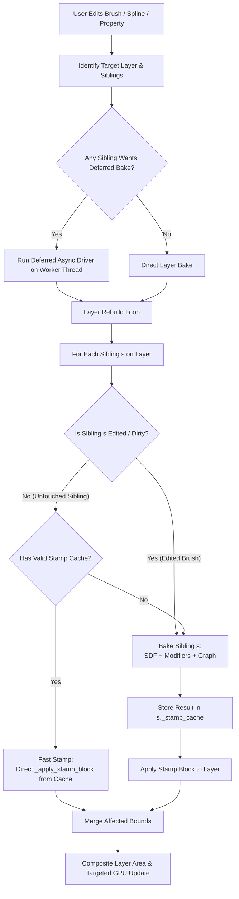
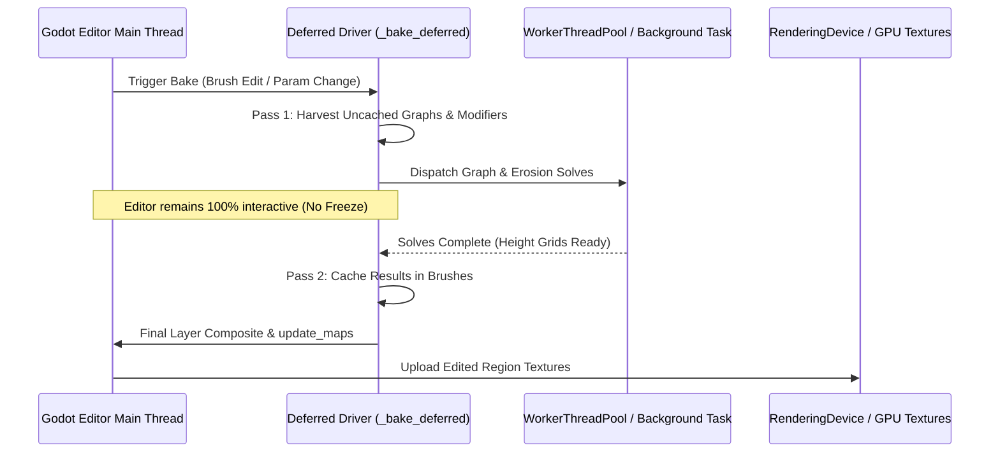

# Pasture3D — Brush Layer Caching & Async Terrain Editing Specification

**Status:** Proposed / Ready for Review  
**Author:** Investigation & Architecture Spec, 2026-08-26  
**Scope:** Editor Performance & Responsiveness across Terrain Brushes, Layers, Node Graphs, Erosion, Sim, and Background Worker Threading.

---

## 1. Problem Statement & Root Cause Analysis

### 1.1 The `sculpting_2` Scene Freeze
When opening and editing landscapes in `project/sculpting_2.tscn`, the Godot editor experiences severe multi-second freezes (often lasting 3 to 10+ seconds per spline drag or property adjustment).

### 1.2 Anatomy of `sculpting_2.tscn`
Analysis of the scene graph reveals extensive brush layer sharing:
- **`pasture3d_brush:Mounds` Layer:** Shared by **7 distinct `Pasture3DMound` instances**:
  1. `Mound` — Modifiers: DLA Growth (`Pasture3DReliefDLA`), Hydraulic Erosion (`Pasture3DNodeErosion`, FROZEN), Fractal Relief with SimResult Selector (`Pasture3DReliefFractal`).
  2. `Mound2` — Modifiers: Heavy 8-node `Pasture3DNodeGraph` (`Resource_ppi2w` containing Input, Smooth [8 passes], Furrows, Blend, Terrace, Scree, Blend, Output).
  3. `Mound1` — Modifiers: Terraces (`Pasture3DReliefTerraces`), Terrain Graph (`Pasture3DNodeGraph`).
  4. `Mound3` — Modifiers: Terrain Graph (`Pasture3DNodeGraph` with Smooth).
  5. `Mound4` — Modifiers: DLA with Ridge Seeding (`Pasture3DReliefDLA`), Relief Material.
  6. `Mound5` — Mound without heavy modifiers.
  7. `Mound6` — Plain Mound.
- **`pasture3d_brush:Plow` Layer:** Shared by **8 distinct `Pasture3DPlow` instances**.
- **`pasture3d_brush:Ridges` Layer:** Shared by **3 distinct `Pasture3DRidge` instances**.
- **`pasture3d_brush:Troughs` Layer:** Shared by **3 distinct `Pasture3DTrough` instances**.
- **`pasture3d_brush:Erosion` Layer:** Shared by **3 distinct `Pasture3DSim` / `Pasture3DSimPass` instances**.

---

### 1.3 Identified Root Causes

#### Cause A: Layer-Granular Rebuild Triggering Every Sibling Brush
In [`pasture3d_terrain_brush.gd:817`](project/addons/pasture_3d/connectors/pasture3d_terrain_brush.gd), brush tools share layers by name (`owner_id = "pasture3d_brush:<name>"`).
When any single brush on a layer is modified (or when an inspector property is edited, invoking `_schedule_refresh()` with `_full_dirty = true`), `_refresh_owner()` is executed:
```gdscript
var sibs := _tools_on_owner(owner)
for s in sibs:
    s._paint_into(layer_id, blend)
```
This forces **all 7 sibling brushes** on `pasture3d_brush:Mounds` to re-execute their entire evaluation and rasterization pipeline sequentially.

#### Cause B: Absence of Brush-Level Stamp Caching
While individual modifiers like `Pasture3DNodeErosion` and `Pasture3DNodeGraph` possess internal modifier-level caches, the **brush itself has no rasterized stamp cache**.
When a sibling brush `s` is asked to `_paint_into()` during a layer rebuild:
1. It re-computes its 2D polygon projection and bounds.
2. It evaluates or GPU/CPU-rasterizes its Signed Distance Field (SDF).
3. It derives host profile fields (slope, curvature, normal, peak divisor).
4. It re-samples below-layer terrain heights across its bounding box.
5. It compiles and iterates its modifier stack.
6. It evaluates any active node graphs and blurs.
7. It writes cells or stamp blocks into the target layer.

None of this work is skipped for unmodified sibling brushes.

#### Cause C: `Pasture3DNodeGraph` Bypasses Deferred Baking & Runs Synchronously on Main Thread
In [`pasture3d_terrain_brush.gd:918`](project/addons/pasture_3d/connectors/pasture3d_terrain_brush.gd):
```gdscript
func _wants_deferred_bake() -> bool:
    for m in erosion_modifiers():
        if m.evaluation == Pasture3DNode.Evaluation.FROZEN:
            return true
    return _has_growing_relief()
```
- `_wants_deferred_bake()` **only** checks erosion modifiers and DLA growth. It **completely ignores** `Pasture3DNodeGraph`!
- Even with multi-pass blurs, hydraulic erosion nodes, furrows, terraces, and scree in the graph, graphs execute **synchronously on the main thread**, locking the Godot editor UI.
- Furthermore, `_wants_deferred_bake()` only inspects `self` (`modifiers`), not sibling brushes (`sibs`). If you edit `Mound5` (a plain mound), `_wants_deferred_bake()` returns `false`, causing the layer rebuild of `Mound` (DLA/Erosion) and `Mound2` (8-node Graph) to execute synchronously on the main thread!

#### Cause D: Ephemeral In-Memory Modifier Caches on Scene Load
Modifier caches (`Pasture3DNodeGraph._cache` and `Pasture3DNodeErosion._cache`) are memory-only dictionaries that are not saved to the `.tscn` file.
When `sculpting_2.tscn` is opened, all caches are empty `{}`. The very first interaction on any brush triggers cache misses on all sibling graphs simultaneously, causing an immediate freeze.

---

## 2. Architectural Solution: Brush Stamp Caching & Sibling Isolation



### 2.1 Brush-Level Stamp Cache (`Pasture3DStampCache`)
Each `Pasture3DTerrainBrush` instance maintains a local cache of its baked raster result:

```gdscript
# Inside Pasture3DTerrainBrush:
class StampEntry:
    var key: int               # Combined hash of inputs (geometry, params, modifier keys, base hash)
    var extent_key: String     # "min_x,min_z,gw,gh"
    var min_px: int            # World grid integer coordinate X (min_x / vs)
    var min_pz: int            # World grid integer coordinate Z (min_z / vs)
    var gw: int                # Grid width in cells
    var gh: int                # Grid height in cells
    var vals: PackedFloat32Array # Baked float height/delta array of size gw * gh
    var bounds: AABB           # World AABB for compositing

var _stamp_cache: Dictionary = {} # spline instance_id -> StampEntry
```

### 2.2 Cache Validity Key Generation
A brush stamp is valid if its signature has not changed:
$$\text{StampKey} = \text{Hash}(\text{SplinePoints}, \text{NodeTransform}, \text{BrushParameters}, \text{ModifierStackContentKey}, \text{BelowLayerTerrainHash})$$

- **Spline Points & Transform:** Uses existing curve hash / point diffs.
- **Brush Parameters:** Hash of `height`, `slope_angle`, `falloff_width`, `edge_offset`, `invert`, `capped`, `flank_mode`, `blend`.
- **Modifier Stack Content Key:** Sum/mix of `content_key()` across all active modifiers.
- **Below-Layer Terrain Hash:** For brushes where `relative_to_terrain = true` or modifiers that read below-layer ground (selectors, filter graphs), the key includes an FNV hash of the below-layer height grid in the footprint.

### 2.3 Sibling-Isolated Layer Rebuild
When `_refresh_owner(owner, ...)` executes:
1. `sibs := _tools_on_owner(owner)`
2. Clear layer within union of footprints.
3. For each `s` in `sibs`:
   - If `s` has a valid stamp cache matching its current key, `s._paint_into()` executes the **fast path**:
     ```gdscript
     # Fast path: Skip SDF, modifiers, graphs
     terrain.data.apply_stamp_block(layer_id, cached_stamp.min_px, cached_stamp.min_pz, 
                                   cached_stamp.gw, cached_stamp.gh, cached_stamp.vals, blend)
     ```
   - If `s` is dirty or has no valid stamp (cache miss): `s` performs its normal bake, updates its `_stamp_cache`, and stamps the layer.
4. Composite layer area once and push only edited regions to the GPU via `terrain.data.update_maps(_map_type(), false, false)`.

---

## 3. Asynchronous & Worker Thread Pipeline for Node Graphs

### 3.1 Unifying `_wants_deferred_bake()`
`_wants_deferred_bake()` is upgraded to inspect **all sibling brushes** on the layer, and check for `Pasture3DNodeGraph`:

```gdscript
func _layer_wants_deferred_bake(owner: String) -> bool:
    if not (Engine.is_editor_hint() or force_deferred_erosion):
        return false
    if _erosion_running or _task_id != -1:
        return false
    if not is_inside_tree():
        return false
    
    for s in _tools_on_owner(owner):
        if s._has_unfrozen_or_missed_graph():
            return true
        if s._has_unfrozen_or_missed_erosion():
            return true
        if s._has_growing_relief():
            return true
    return false
```

### 3.2 Worker Thread Graph Evaluation
Graph execution (`Pasture3DTerrainGraph.eval_grid` and `Pasture3DGraphOps`) is integrated with the deferred driver:
- **Phase A:** Grow pending relief fields (DLA) on worker thread.
- **Phase B:** Solve pending node graphs (`Pasture3DNodeGraph`) on worker thread.
- **Phase C:** Solve pending hydraulic/thermal erosion on worker thread.
- **Phase D:** Final composite and GPU push on main thread.



---

## 4. Comprehensive Review of All Editor-Freezing Areas in Pasture3D

The following table provides a complete audit of all terrain editing systems that can freeze the editor and how they are addressed:

| # | System / Subsystem | Location | Cost / Freeze Driver | Worker Threading / Optimization Strategy |
|---|-------------------|----------|---------------------|------------------------------------------|
| **1** | **Terrain Graphs (`Pasture3DTerrainGraph`)** | `pasture3d_mod_graph.gd`, `pasture3d_graph_ops.cpp` | Multi-pass smooth blurs, furrows, hydraulic/thermal graph nodes, scree, terraces over large grids (512²–2048²). | Integrate into `_bake_deferred` worker driver. Offload C++ grid ops to `WorkerThreadPool::add_native_group_task`. |
| **2** | **Hydraulic & Thermal Erosion** | `pasture3d_mod_erosion.gd`, `pasture3d_sim_manager.gd`, `pasture_3d_sim.cpp` | Water flow routing, sediment transport, talus deposition across iterations (100–1000 iters). | Already uses `_solve_on_worker`, but must be guaranteed on all layer-rebuild entry points and unified with graph passes. |
| **3** | **Diffusion-Limited Aggregation (DLA)** | `pasture3d_relief_dla.gd`, `pasture_3d_brush_raster.cpp` | Random Brownian particle walks over dense grids. | Handled via `_grow_pending` on worker threads; cache grown fields per loop extent. |
| **4** | **CPU SDF Rasterization (`raster_sdf`)** | `pasture_3d_brush_raster.cpp:1063` | Chamfer 8-point distance transform on large loops when GPU threshold is not met or unavailable. | Parallelize horizontal/vertical Chamfer passes across slices using worker tasks. |
| **5** | **Sibling Brush Layer Cascades** | `pasture3d_terrain_brush.gd:817` | Re-evaluating $N$ untouched sibling brushes when 1 brush is edited. | Implement **Brush-Level Stamp Caching** (§2) so untouched siblings execute in $O(1)$ time via `_apply_stamp_block`. |
| **6** | **Layer Compositing (`composite_area`)** | `pasture_3d_data.cpp:2130` | Iterating all layers to composite height/control/color across multiple regions. | Batch dirty rects; defer compositing during batch writes; composite only the minimal grown bounding AABB. |
| **7** | **Texture & Normal Map Generation (`update_maps`)** | `pasture_3d_data.cpp:1250` | Re-generating float normal maps, colormaps, and uploading texture arrays to GPU. | Use `update_maps(type, false, false)` (edited regions only) on all brush paths. |
| **8** | **In-Editor Collision Shape Building** | `pasture_3d_collision.cpp:232` | Generating `HeightMapShape3D` objects for each terrain region. | Deferred/skipped in-editor where mouse picking uses GPU buffer instead of physics raycasts. |
| **9** | **MultiMesh Foliage Updates (`Pasture3DInstancer`)** | `pasture_3d_instancer.cpp:561` | Density sampling, transform baking, and MultiMesh buffer rebuilds across cells. | Offload cell density and transform generation to background tasks. |
| **10** | **Spline Surface Snapping** | `pasture3d_terrain_brush.gd:1314` | Repeated raycasting / height queries across all spline points on drag. | Snap only moved point indices (`_moved_point_indices`) against cached base height; avoid re-snapping untouched points. |

---

## 5. Verification & Testing Strategy

1. **`sculpting_2.tscn` Interactive Performance Test:**
   - Open `project/sculpting_2.tscn` in the Godot Editor.
   - Select and drag spline points on `Mound5` (plain mound sharing `pasture3d_brush:Mounds`).
   - Verify that `Mound2` (8-node Graph) and `Mound` (DLA/Erosion) do **not** freeze the editor.
   - Measure frame rate and ensure interaction latency is $\le 16\text{ ms}$ (smooth 60 FPS).
2. **Brush Stamp Cache Verification:**
   - Confirm that editing `Mound5` uses cached stamps for `Mound`, `Mound1`, `Mound2`, `Mound3`, `Mound4`, `Mound6`.
   - Confirm that editing a parameter on `Mound2` (e.g. graph node setting) invalidates only `Mound2`'s stamp, bakes `Mound2` in the background, and preserves other sibling stamps.
3. **Automated Regression & Parity Gates:**
   - Run benchmark gates (`GraphFreezeGate.gd`, `GraphMountGate.gd`, `GraphNativeBakeGate.gd`).
   - Verify that terrain height output is bitwise identical to synchronous bakes.
