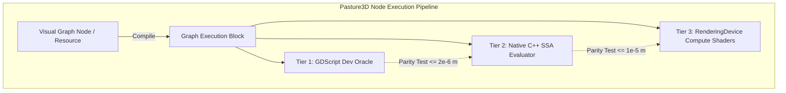

# Pasture3D Erosion & Geomorphology Expansion Spec — Hesiod Parity Architecture

**Status:** Proposed Architecture & Node Specification (2026-08-28)  
**Origin:** Comprehensive gap analysis against [Hesiod](https://github.com/ottolink-dev/Hesiod) and [HighMap](https://github.com/ottolink-dev/HighMap) (ottolink-dev).  
**Licensing & Strategy:** 100% clean-room native Godot 4 / GDExtension MIT implementations (`RenderingDevice` compute shaders + C++ SSE/AVX loops + pure GDScript reference oracles). Free of GPL copyleft and external library dependencies (no OpenCV, OpenCL, or CUDA).  
**Builds on:** `PASTURE3D_TERRAIN_GRAPH_SPEC.md`, `PASTURE3D_NODE_VOCABULARY.md`, `PASTURE3D_TERRAIN_GRAPH_EXPANSION_SPEC.md`, `PASTURE3D_SOLVER_NATIVE_ACCELERATION_SPEC.md`.

---

## 1. Executive Summary & Inventory Gap Analysis

This specification defines the complete roadmap for implementing the unbuilt **Erosion, Weathering, and Geomorphological Incision** node family from Hesiod into Pasture3D's Terrain Node Graph.

### 1.1 Existing Pasture3D Implementations vs. Hesiod
Pasture3D already possesses several foundational erosion and hydrology nodes:
* `erosion_hydraulic` (`Pasture3DGraphNodeErosionHydraulic`) — Grid-based Eulerian continuous hydrodynamic solver (rain rate, capacity, pickup, transport, deposition, evaporation).
* `erosion_thermal` (`Pasture3DGraphNodeErosionThermal`) — Classic talus slope relaxation past angle of repose.
* `erosion` (`Pasture3DGraphNodeErosion`) — Stream-power fluvial erosion solver with output channels (flow, erosion, deposition, wetness).
* `scree` (`Pasture3DGraphNodeScree`) — Steep-ground loose rock relief generator.
* `talus_projection` (`Pasture3DGraphNodeTalusProjection`) — Iterative angle-of-repose slope relaxation filter.
* `depression_filling` (`Pasture3DGraphNodeDepressionFilling`) — Planchon-Darboux / Priority-Flood hydrological sink filling.
* `lake_flooding` (`Pasture3DGraphNodeLakeFlooding`) — Catchment basin lake solver + `Pasture3DPond` / `Pasture3DPool` authoring tool.
* `stream_extraction` (`Pasture3DGraphNodeStreamExtraction`) — Flow routing + river thalweg channel carver + `Pasture3DStream` spline generator.

### 1.2 Identified Node Gap (Unimplemented in Pasture3D)
A total of **20 distinct node types** from Hesiod's erosion, thermal, coastal, and structural geomorphology categories are not yet implemented in Pasture3D:

| # | Hesiod Node Name | Proposed Pasture3D Class | Role | Category | Primary Algorithmic Mechanism |
|---|---|---|---|---|---|
| **1** | `HydraulicParticle` | `Pasture3DGraphNodeHydraulicParticle` | `SOLVER` | Solvers & Realism | Eulerian-Lagrangian droplet simulation (inertia, velocity, droplet life, sediment dissolution/deposition). |
| **2** | `HydraulicStreamLog` | `Pasture3DGraphNodeHydraulicStreamLog` | `SOLVER` | Solvers & Realism | Logarithmic stream-power riverbed incision ($E = K \log(1 + A^m S^n)$) preventing runaway gorge blowouts. |
| **3** | `HydraulicSaleve` | `Pasture3DGraphNodeHydraulicSaleve` | `SOLVER` | Solvers & Realism | Salève structural hydraulic solver with sub-grid stream interpolation, joint-aligned runoff, and ridge conservation. |
| **4** | `HydraulicProcedural` | `Pasture3DGraphNodeHydraulicProcedural` | `FILTER` | Filters & Modifiers | Analytical multi-scale procedural drainage synthesis (instant non-iterative dendritic gullies). |
| **5** | `HydraulicVpipes` | `Pasture3DGraphNodeHydraulicVpipes` | `SOLVER` | Solvers & Realism | 4-way virtual pipe shallow water simulation with hydrostatic pressure and dynamic momentum flux. |
| **6** | `HydraulicMusgrave` | `Pasture3DGraphNodeHydraulicMusgrave` | `SOLVER` | Solvers & Realism | Musgrave classic (1989) sediment transport and fluvial redistribution model. |
| **7** | `ThermalAutoBedrock` | `Pasture3DGraphNodeThermalAutoBedrock` | `SOLVER` | Solvers & Realism | Multi-layer differential thermal erosion with auto-generated bedrock resistance and undercut ledges. |
| **8** | `ThermalFlatten` | `Pasture3DGraphNodeThermalFlatten` | `FILTER` | Filters & Modifiers | Thermal relaxation biased toward stable horizontal plateaus, structural benches, and mesas. |
| **9** | `ThermalRidge` | `Pasture3DGraphNodeThermalRidge` | `FILTER` | Filters & Modifiers | Thermal weathering with crest preservation and knife-edge arête sharpening. |
| **10**| `ThermalScree` | `Pasture3DGraphNodeThermalScree` | `SOLVER` | Solvers & Realism | Physics-based debris chute detachment, ballistic fall, and conical talus apron accumulation. |
| **11**| `ThermalInflate` | `Pasture3DGraphNodeThermalInflate` | `FILTER` | Filters & Modifiers | Periglacial frost-heave and expansive regolith swell on weathered slopes. |
| **12**| `CoastalErosionDiffusion`| `Pasture3DGraphNodeCoastalErosionDiffusion`| `FILTER` | Filters & Modifiers | Marine wave-action diffusion, nearshore sediment smoothing, and shallow water shoaling. |
| **13**| `CoastalErosionProfile`  | `Pasture3DGraphNodeCoastalErosionProfile`  | `FILTER` | Filters & Modifiers | Wave-cut notch carving, sea cliff retreat, wave-cut platform and marine terrace profiling. |
| **14**| `CoastalFetch` | `Pasture3DGraphNodeCoastalFetch` | `FILTER` | Filters & Modifiers | Raymarched open-water wind fetch solver to compute directional wave energy masks. |
| **15**| `Rifts` / `Rift` | `Pasture3DGraphNodeRifts` | `GENERATOR` | Generators | Tectonic faulting, graben rift valleys, and opposing fault-scarp generation. |
| **16**| `RecastCanyon` | `Pasture3DGraphNodeRecastCanyon` | `FILTER` | Filters & Modifiers | Non-linear slot canyon and gorge carving along fracture paths and drainage thalwegs. |
| **17**| `RecastCliff` | `Pasture3DGraphNodeRecastCliff` | `FILTER` | Filters & Modifiers | Escarpment formation, cliff sapping, and directional structural scarp retreat. |
| **18**| `RecastCracks` | `Pasture3DGraphNodeRecastCracks` | `FILTER` | Filters & Modifiers | Structural joint network weathering and fracture widening. |
| **19**| `Mudslide` | `Pasture3DGraphNodeMudslide` | `SOLVER` | Solvers & Realism | Saturated soil liquefaction, viscous mass wasting, and debris flow runout simulation. |
| **20**| `WarpDownslope` | `Pasture3DGraphNodeWarpDownslope` | `FILTER` | Filters & Modifiers | Gradient-directed coordinate advection modeling periglacial solifluction and slow soil creep. |

---

## 2. Standardized Pasture3D Node Architecture

All new nodes follow the three-tier execution pipeline established in Pasture3D:
1. **Tier 1: GDScript Reference Oracle** in `project/addons/pasture_3d/graph/pasture3d_graph_node_dev_*.gd` (clean ground truth for unit tests and headless verification).
2. **Tier 2: C++ GDExtension SSA / Grid Engine** in `src/pasture_3d_*.cpp` and `pasture_3d_graph_ops.cpp` (multithreaded native CPU SIMD execution).
3. **Tier 3: `RenderingDevice` GPU Compute Shaders** in `src/shaders/graph_*.glsl` (asynchronous high-resolution evaluation for large footprints $\ge 256^2$).



---

## 3. Detailed Specifications for Priority Node Groups

### 3.1 Group A: Hydraulic Simulation & Solvers

#### 1. `Pasture3DGraphNodeHydraulicParticle` (`op = &"hydraulic_particle"`)
* **Role:** `Role.SOLVER` (`needs_grid() = true`, defaults to `Evaluation.FROZEN`).
* **Concept:** Eulerian-Lagrangian droplet simulation. Unlike grid-based rainfall, this casts $N$ virtual water droplets across the heightmap with momentum vectors, tracking particle life, velocity, carrying capacity, dissolution, and deposition:
  $$\mathbf{v}_{t+1} = \mathbf{v}_t \cdot (1 - \mu) - \nabla h(\mathbf{p}_t) \cdot g \cdot \Delta t$$
  $$\mathbf{p}_{t+1} = \mathbf{p}_t + \mathbf{v}_{t+1} \cdot \Delta t$$
  $$C = \max(\|\mathbf{v}\|, v_{\min}) \cdot \text{slope} \cdot w_{\text{water}} \cdot K_c$$
  If sediment carried $s < C$, pick up soil: $\Delta s = \min((C - s) \cdot K_{\text{erode}}, \Delta h_{\max})$.  
  If sediment carried $s > C$, drop soil: $\Delta s = (s - C) \cdot K_{\text{deposit}}$.
* **Ports:**
  * **Inputs:** `in` (HEIGHT), `mask` (MASK, optional), `iterations` (INT), `droplet_count` (INT), `inertia` (FLOAT), `capacity` (FLOAT), `erosion_rate` (FLOAT), `deposition_rate` (FLOAT), `evaporation` (FLOAT).
  * **Outputs:** 
    * `0: height` (HEIGHT) — Eroded elevation map.
    * `1: sediment` (MASK) — Cumulative deposition map.
    * `2: flow` (MASK) — Droplet traversal path density.
    * `3: water_depth` (MASK) — Residual surface water.
* **Authoring Integration:** Inline `Bake` button, deterministic random seed, and optional brush boundary clipping.

#### 2. `Pasture3DGraphNodeHydraulicStreamLog` (`op = &"hydraulic_stream_log"`)
* **Role:** `Role.SOLVER` (`needs_grid() = true`).
* **Concept:** Logarithmic stream-power bedrock incision. Prevents unrealistic knife-edge runaway incisions by scaling erosion logarithmically with upstream catchment area $A$ and slope $S$:
  $$E(\mathbf{x}) = K \cdot \log\left(1 + A(\mathbf{x})^m \cdot \|\nabla h(\mathbf{x})\|^n\right)$$
* **Ports:**
  * **Inputs:** `in` (HEIGHT), `mask` (MASK), `incision_rate` (FLOAT), `area_exponent` (FLOAT, $m \approx 0.5$), `slope_exponent` (FLOAT, $n \approx 1.0$), `min_catchment` (FLOAT).
  * **Outputs:** `0: height` (HEIGHT), `1: channel_mask` (MASK), `2: flow_accumulation` (MASK).

#### 3. `Pasture3DGraphNodeHydraulicSaleve` (`op = &"hydraulic_saleve"`)
* **Role:** `Role.SOLVER` (`needs_grid() = true`).
* **Concept:** High-precision Salève structural model featuring bicubic sub-grid runoff advection, joint-aligned fracture bias, and crest curvature weighting to prevent rounding off mountain ridges during water carving.
* **Ports:**
  * **Inputs:** `in` (HEIGHT), `joint_azimuth` (FLOAT), `joint_strength` (FLOAT), `ridge_preservation` (FLOAT), `iterations` (INT).
  * **Outputs:** `0: height` (HEIGHT), `1: eroded_rock` (MASK), `2: sediment` (MASK).

#### 4. `Pasture3DGraphNodeHydraulicProcedural` (`op = &"hydraulic_procedural"`)
* **Role:** `Role.FILTER` (`needs_grid() = true`, fast/real-time `Evaluation.LIVE`).
* **Concept:** Analytical procedural synthesis of dendritic drainage networks using multi-scale ridge-opposed distance transforms and gradient divergence. Provides instant erosion aesthetics in brush workflows without iterative time-step solves.
* **Ports:**
  * **Inputs:** `in` (HEIGHT), `scale` (FLOAT), `octaves` (INT), `gully_depth` (FLOAT), `sharpness` (FLOAT).
  * **Outputs:** `0: height` (HEIGHT), `1: gully_mask` (MASK).

#### 5. `Pasture3DGraphNodeHydraulicVpipes` (`op = &"hydraulic_vpipes"`)
* **Role:** `Role.SOLVER` (`needs_grid() = true`, GPU compute accelerated).
* **Concept:** 4-way virtual pipe hydrodynamic model (O'Callaghan & Mark / Mei / Stava). Solves full shallow water equations with hydrostatic pressure, inter-cell flux $(f_L, f_R, f_T, f_B)$, velocity fields, and dual-layer sediment advection.
* **Ports:**
  * **Inputs:** `in` (HEIGHT), `rain_flux` (FLOAT), `pipe_cross_section` (FLOAT), `viscosity` (FLOAT), `iterations` (INT).
  * **Outputs:** `0: height` (HEIGHT), `1: water_depth` (MASK), `2: velocity` (VECTOR2/MASK), `3: sediment` (MASK).

---

### 3.2 Group B: Thermal Weathering & Talus Systems

#### 1. `Pasture3DGraphNodeThermalAutoBedrock` (`op = &"thermal_auto_bedrock"`)
* **Role:** `Role.SOLVER` (`needs_grid() = true`).
* **Concept:** Multi-strata thermal weathering where bedrock resistance varies with elevation and depth ($R(z) = R_0 + \sin(\omega z)$). Softer rock layers weather and slump rapidly, creating undercut cliffs, stepped benches, and natural caprocks.
* **Ports:**
  * **Inputs:** `in` (HEIGHT), `strata_frequency` (FLOAT), `hardness_contrast` (FLOAT), `talus_angle` (FLOAT), `iterations` (INT).
  * **Outputs:** `0: height` (HEIGHT), `1: scree_mask` (MASK), `2: exposed_bedrock` (MASK).

#### 2. `Pasture3DGraphNodeThermalFlatten` (`op = &"thermal_flatten"`)
* **Role:** `Role.FILTER` (`needs_grid() = true`).
* **Concept:** Thermal relaxation biased toward flat structural terraces and plateaus. Slopes within a threshold of horizontal remain flat, while steep edges crumble to the angle of repose.
* **Ports:**
  * **Inputs:** `in` (HEIGHT), `plateau_stability` (FLOAT), `talus_angle` (FLOAT), `iterations` (INT).
  * **Outputs:** `0: height` (HEIGHT), `1: terrace_edges` (MASK).

#### 3. `Pasture3DGraphNodeThermalRidge` (`op = &"thermal_ridge"`)
* **Role:** `Role.FILTER` (`needs_grid() = true`).
* **Concept:** Curvature-gated thermal erosion that softens mountain flanks and debris skirts while sharpening convex knife-edge arêtes and mountain peaks.
* **Ports:**
  * **Inputs:** `in` (HEIGHT), `ridge_sharpness` (FLOAT), `talus_angle` (FLOAT), `iterations` (INT).
  * **Outputs:** `0: height` (HEIGHT), `1: ridge_mask` (MASK).

#### 4. `Pasture3DGraphNodeThermalScree` (`op = &"thermal_scree"`)
* **Role:** `Role.SOLVER` (`needs_grid() = true`).
* **Concept:** Physically-based rockfall chute simulation. Detaches rock material from cliffs exceeding a detachment slope $\theta_{\text{cliff}}$, casts debris down the fall line, and deposits conical talus fans (scree aprons) with natural angle of repose ($\approx 32^\circ - 38^\circ$).
* **Ports:**
  * **Inputs:** `in` (HEIGHT), `cliff_threshold` (FLOAT), `repose_angle` (FLOAT), `debris_volume` (FLOAT), `chute_convergence` (FLOAT).
  * **Outputs:** `0: height` (HEIGHT), `1: talus_depth` (MASK), `2: detachment_scarp` (MASK).

---

### 3.3 Group C: Coastal & Marine Erosion

#### 1. `Pasture3DGraphNodeCoastalErosionDiffusion` (`op = &"coastal_erosion_diffusion"`)
* **Role:** `Role.FILTER` (`needs_grid() = true`).
* **Concept:** Marine shallow-water wave action diffusion. Simulates constant wave swash and backwash smoothing the shoreline and shallow sea floor while steepening the beach berm.
* **Ports:**
  * **Inputs:** `in` (HEIGHT), `sea_level` (FLOAT), `wave_depth_limit` (FLOAT), `diffusion_strength` (FLOAT), `swash_steepness` (FLOAT).
  * **Outputs:** `0: height` (HEIGHT), `1: littoral_deposit` (MASK).

#### 2. `Pasture3DGraphNodeCoastalErosionProfile` (`op = &"coastal_erosion_profile"`)
* **Role:** `Role.FILTER` (`needs_grid() = true`).
* **Concept:** Marine cliff profile carver. Simulates hydraulic wave pounding at the intertidal zone, cutting a wave-cut notch at sea level, triggering sea-cliff collapse, and leaving a planar wave-cut platform / shore terrace.
* **Ports:**
  * **Inputs:** `in` (HEIGHT), `sea_level` (FLOAT), `tidal_range` (FLOAT), `notch_depth` (FLOAT), `platform_slope` (FLOAT), `cliff_retreat` (FLOAT).
  * **Outputs:** `0: height` (HEIGHT), `1: sea_cliff_mask` (MASK), `2: platform_mask` (MASK).

#### 3. `Pasture3DGraphNodeCoastalFetch` (`op = &"coastal_fetch"`)
* **Role:** `Role.FILTER` (`needs_grid() = true`).
* **Concept:** Raymarched open-water wind fetch solver. Casts rays in wind directions over terrain below `sea_level` to compute the uninterrupted water distance, yielding a wave exposure intensity mask that drives coastal erosion power.
* **Ports:**
  * **Inputs:** `in` (HEIGHT), `sea_level` (FLOAT), `wind_angle` (FLOAT), `wind_spread` (FLOAT), `max_fetch_distance` (FLOAT).
  * **Outputs:** `0: fetch_mask` (MASK), `1: wave_energy` (MASK).

---

### 3.4 Group D: Structural Geomorphology & Incision

#### 1. `Pasture3DGraphNodeRifts` (`op = &"rifts"`)
* **Role:** `Role.GENERATOR` / `Role.FILTER` (`needs_grid() = true`).
* **Concept:** Tectonic rift valley and fault scarp generator. Displaces terrain along branching fault lines with graben down-drop, footwall uplift, and asymmetric tilted blocks.
* **Ports:**
  * **Inputs:** `in` (HEIGHT, optional), `rift_depth` (FLOAT), `rift_width` (FLOAT), `footwall_uplift` (FLOAT), `fault_angle` (FLOAT), `meander` (FLOAT).
  * **Outputs:** `0: height` (HEIGHT), `1: fault_scarp_mask` (MASK), `2: graben_floor` (MASK).

#### 2. `Pasture3DGraphNodeRecastCanyon` (`op = &"recast_canyon"`)
* **Role:** `Role.FILTER` (`needs_grid() = true`).
* **Concept:** Carves steep V-shaped canyons and slot gorges into elevated plateaus along drainage routes or voronoi/fracture guides, producing vertical side walls with stepped talus bases.
* **Ports:**
  * **Inputs:** `in` (HEIGHT), `guide_mask` (MASK), `depth` (FLOAT), `width` (FLOAT), `wall_slope` (FLOAT), `bench_step` (FLOAT).
  * **Outputs:** `0: height` (HEIGHT), `1: canyon_floor` (MASK), `2: canyon_walls` (MASK).

#### 3. `Pasture3DGraphNodeRecastCliff` (`op = &"recast_cliff"`)
* **Role:** `Role.FILTER` (`needs_grid() = true`).
* **Concept:** Directional scarp retreat and cuesta cliff formation. Emphasizes structural escarpments facing a specified azimuth while tapering the reverse dip slope.
* **Ports:**
  * **Inputs:** `in` (HEIGHT), `scarp_azimuth` (FLOAT), `scarp_steepness` (FLOAT), `cliff_height` (FLOAT), `undercut` (FLOAT).
  * **Outputs:** `0: height` (HEIGHT), `1: cliff_face_mask` (MASK).

#### 4. `Pasture3DGraphNodeMudslide` (`op = &"mudslide"`)
* **Role:** `Role.SOLVER` (`needs_grid() = true`).
* **Concept:** Viscous non-Newtonian Bingham fluid mass wasting. When slope and pore water saturation exceed failure thresholds, soil liquefies and flows down gullies, forming depositional lobes at the base.
* **Ports:**
  * **Inputs:** `in` (HEIGHT), `saturation_map` (MASK), `yield_stress` (FLOAT), `viscosity` (FLOAT), `iterations` (INT).
  * **Outputs:** `0: height` (HEIGHT), `1: slide_scar` (MASK), `2: deposit_lobe` (MASK).

#### 5. `Pasture3DGraphNodeWarpDownslope` (`op = &"warp_downslope"`)
* **Role:** `Role.FILTER` (`needs_grid() = true`).
* **Concept:** Gradient-directed 2D coordinate advection. Warps height and surface texture coordinates in the direction of $-\nabla h$, simulating natural soil creep, permafrost solifluction lobes, and gravity draping.
* **Ports:**
  * **Inputs:** `in` (HEIGHT), `creep_strength` (FLOAT), `slope_power` (FLOAT), `smoothing` (FLOAT).
  * **Outputs:** `0: height` (HEIGHT), `1: creep_displacement` (VECTOR2/MASK).

---

## 4. Implementation & Integration Roadmap

```
                                IMPLEMENTATION PHASES
┌────────────────────────────────────────────────────────────────────────────────────────┐
│ Phase 1: Lagrangian Hydraulic & Droplet Simulation                                     │
│  - Pasture3DGraphNodeHydraulicParticle (GDScript dev oracle + C++ multithreaded + GPU) │
│  - Pasture3DGraphNodeHydraulicStreamLog (Logarithmic stream incision solver)           │
│  - Headless Parity Gate: GraphHydraulicParticleGate.tscn                               │
├────────────────────────────────────────────────────────────────────────────────────────┤
│ Phase 2: Multi-Layer Thermal & Bedrock Weathering                                      │
│  - Pasture3DGraphNodeThermalAutoBedrock (Multi-strata hardness profile)                │
│  - Pasture3DGraphNodeThermalScree (Physics talus chute & cone accumulation)            │
│  - Pasture3DGraphNodeThermalFlatten & Pasture3DGraphNodeThermalRidge                   │
│  - Headless Parity Gate: GraphThermalScreeGate.tscn                                    │
├────────────────────────────────────────────────────────────────────────────────────────┤
│ Phase 3: Coastal & Marine Geomorphology                                                │
│  - Pasture3DGraphNodeCoastalErosionProfile (Wave-cut notch / platform solver)          │
│  - Pasture3DGraphNodeCoastalErosionDiffusion (Marine swash diffusion)                  │
│  - Pasture3DGraphNodeCoastalFetch (Open-water wind fetch raymarcher)                   │
│  - Headless Parity Gate: GraphCoastalProfileGate.tscn                                  │
├────────────────────────────────────────────────────────────────────────────────────────┤
│ Phase 4: Structural Incision, Rifts & Mass Wasting                                     │
│  - Pasture3DGraphNodeRifts, RecastCanyon, RecastCliff, RecastCracks                    │
│  - Pasture3DGraphNodeMudslide & WarpDownslope                                          │
│  - Headless Parity Gate: GraphGeomorphIncisionGate.tscn                                │
└────────────────────────────────────────────────────────────────────────────────────────┘
```

---

## 5. Parity & House Discipline Standards

Each implemented node must pass an automated headless parity gate in `project/bench/` verifying:
1. **Oracle Parity:** Numerical difference between the GDScript ground-truth oracle and the C++ engine $\le 2\times 10^{-6}\text{ m}$.
2. **GPU Parity:** Compute shader execution on `RenderingDevice` matches CPU baseline within single-precision floating point limits ($\le 1\times 10^{-5}\text{ m}$).
3. **Conservation Laws:** Mass conservation verification for closed systems (e.g. `ThermalScree` $\Delta V = 0 \pm 0.01\%$).
4. **Boundary Invariance:** Strict preservation of NaN/brush masks at footprint boundaries.
