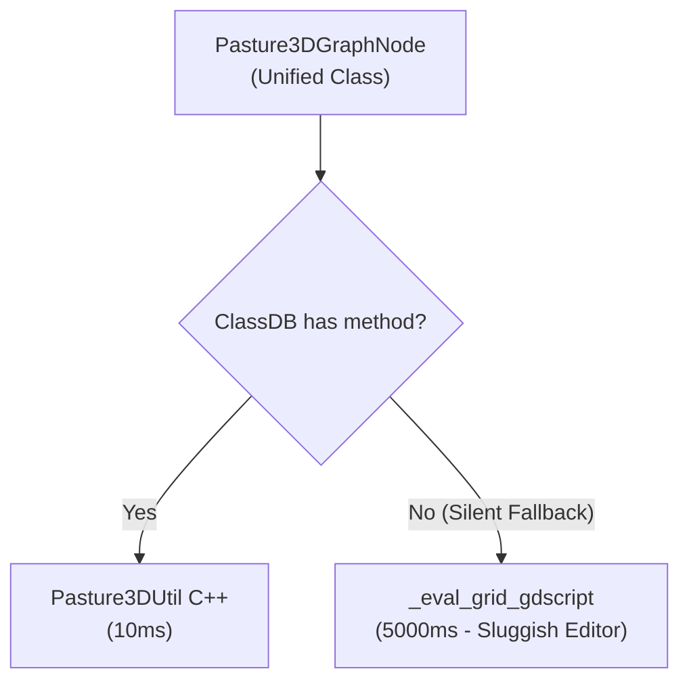
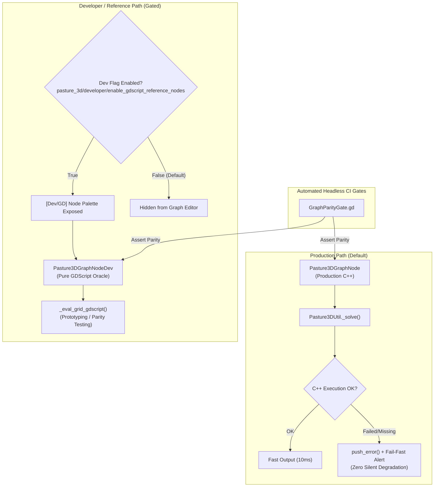

# Pasture3D GDScript & C++ Node Separation Specification

**Document:** `PASTURE3D_GDSCRIPT_CPP_NODE_SEPARATION_SPEC.md`  
**Status:** Architecture Specification  
**Target:** Pasture3D Terrain Graph System (Godot 4.x GDExtension, C++20, GDScript)  
**Author / Context:** LaughingRooster / Pasture3D Development Team  

---

## 1. Executive Summary & Problem Statement

### Background
Pasture3D is an editor-only authoring system (Windows & Linux desktop) used to generate terrain heightmaps, splines, and texture layers for games. It does not export to mobile or web runtime platforms.

Previously, Pasture3D terrain graph nodes used a 3-tier hybrid model where a node first attempted native C++ execution via `Pasture3DUtil`, and silently fell back to an interpreted `_eval_grid_gdscript()` loop if the native method was missing or uncompiled.

### The Problem
1. **Performance Degradation & Editor Freezes:** Interpreted GDScript solvers for operations like Hydraulic Erosion, DLA, or Depression Filling take $2$ to $10+$ seconds on $512^2$–$1024^2$ grids. When a native binding fails, the silent fallback degrades performance by $50\times$–$250\times$, locking up the Godot editor.
2. **Hidden Bugs:** Silent fallback obscures missing GDExtension symbols, signature mismatches, and build issues during development instead of failing fast and alerting the developer.
3. **Polluted User Experience:** Production end-users should only interact with high-performance, deterministic C++ nodes.

### The Solution
1. **Strict Separation of Nodes:**
   - **Production Nodes:** Pure C++ native callers with **fail-fast** error reporting (no silent fallback).
   - **`[Dev/GD]` Nodes:** Pure GDScript reference/oracle implementations prefixed with `[Dev/GD]` and tagged with `&"dev_*"` ops.
2. **Experimental / Developer Gate:**
   - An editor setting / project toggle (`pasture_3d/developer/enable_gdscript_reference_nodes`, default: `false`) hides all `[Dev/GD]` nodes from the palette.
3. **Preserved Parity Testing:**
   - Headless CI gates directly instantiate both production and `[Dev/GD]` nodes to verify mathematical equivalence.

---

## 2. Architectural Comparison

### Previous Hybrid Model (Silent Degradation)


### New Segregated Model (Fail-Fast & Explicit Dev Mode)


---

## 3. Detailed Component Specifications

### 3.1 Production C++ Nodes (Fail-Fast)
Production nodes inherit from `Pasture3DGraphNode`. They never execute interpreted mathematical simulation loops.

**Design Rules:**
1. Call `Pasture3DUtil.<method_name>()` directly.
2. If `ClassDB.class_has_method("Pasture3DUtil", ...)` returns `false` or the native kernel returns an error dictionary / empty array:
   - Call `push_error("[Pasture3D] Native kernel '<method>' not available or failed. Please ensure GDExtension is compiled.")`.
   - Return safe fallback data (e.g. duplicate input surface or zeros) so the graph DAG does not hard-crash the host engine, but surfaces the failure immediately in the Output console and debugger.

**Example Implementation (`pasture3d_graph_node_erosion_hydraulic.gd`):**
```gdscript
@tool
class_name Pasture3DGraphNodeErosionHydraulic
extends Pasture3DGraphNode

func op() -> StringName:
	return &"erosion_hydraulic"

func role() -> Role:
	return Role.SOLVER

func eval_grid_channels(p_inputs: Array, p_gw: int, p_gh: int, p_mask, p_rect: Rect2) -> Array:
	var surface: PackedFloat32Array = p_inputs[0] if (p_inputs.size() > 0 and p_inputs[0] is PackedFloat32Array) else Pasture3DGraphOps.zeros(p_gw * p_gh)
	
	var params := {
		"iterations": iterations,
		"rain_rate": rain_rate,
		"evaporation_rate": evaporation_rate,
		"sediment_capacity": sediment_capacity,
		"erosion_speed": erosion_speed,
		"deposition_speed": deposition_speed,
		"min_slope": min_slope,
	}

	if not ClassDB.class_has_method("Pasture3DUtil", "erosion_hydraulic_solve_grid_best"):
		push_error("[Pasture3D] Pasture3DUtil.erosion_hydraulic_solve_grid_best is not bound. Rebuild GDExtension.")
		return [surface, Pasture3DGraphOps.zeros(p_gw * p_gh), Pasture3DGraphOps.zeros(p_gw * p_gh)]

	var res: Dictionary = Pasture3DUtil.erosion_hydraulic_solve_grid_best(surface, p_gw, p_gh, p_rect, params)
	if not bool(res.get("ok", false)):
		push_error("[Pasture3D] Hydraulic erosion native solve failed.")
		return [surface, Pasture3DGraphOps.zeros(p_gw * p_gh), Pasture3DGraphOps.zeros(p_gw * p_gh)]

	return [res["height"], res["sediment"], res["flow"]]
```

---

### 3.2 Developer / Reference Nodes (`[Dev/GD]`)
Developer reference nodes reside in dedicated files (e.g. `pasture3d_graph_node_dev_erosion_hydraulic.gd`).

**Design Rules:**
1. Class name follows `Pasture3DGraphNodeDev<Name>`.
2. `op()` returns `&"dev_<name>"` (e.g. `&"dev_erosion_hydraulic"`).
3. `label` defaults to `"[Dev/GD] <Name>"`.
4. Role is set to `Role.SOLVER` or `Role.FILTER`, but registered in the palette under `role: "Dev / Reference"`.
5. Contains the pure GDScript mathematical algorithm used as the reference oracle.

**Example Implementation (`pasture3d_graph_node_dev_erosion_hydraulic.gd`):**
```gdscript
@tool
class_name Pasture3DGraphNodeDevErosionHydraulic
extends Pasture3DGraphNode

func op() -> StringName:
	return &"dev_erosion_hydraulic"

func role() -> Role:
	return Role.SOLVER

func eval_grid_channels(p_inputs: Array, p_gw: int, p_gh: int, p_mask, p_rect: Rect2) -> Array:
	var surface: PackedFloat32Array = p_inputs[0] if (p_inputs.size() > 0 and p_inputs[0] is PackedFloat32Array) else Pasture3DGraphOps.zeros(p_gw * p_gh)
	var params := {
		"iterations": iterations,
		"rain_rate": rain_rate,
		"evaporation_rate": evaporation_rate,
		"sediment_capacity": sediment_capacity,
		"erosion_speed": erosion_speed,
		"deposition_speed": deposition_speed,
		"min_slope": min_slope,
	}
	return solve_oracle(surface, p_gw, p_gh, p_rect, params)

static func solve_oracle(p_surface: PackedFloat32Array, p_gw: int, p_gh: int, p_rect: Rect2, p_params: Dictionary) -> Array:
	# Pure GDScript algorithm implementation...
	...
```

---

### 3.3 Node Registry & Palette Filtering

Update `Pasture3DGraphNodeRegistry` to support dynamic filtering based on developer settings.

#### Project & Editor Settings
- Setting Name: `pasture_3d/developer/enable_gdscript_reference_nodes`
- Type: `bool`
- Default: `false`

#### Registry Implementation
```gdscript
static func is_dev_nodes_enabled() -> bool:
	if Engine.is_editor_hint():
		if ProjectSettings.has_setting("pasture_3d/developer/enable_gdscript_reference_nodes"):
			return bool(ProjectSettings.get_setting("pasture_3d/developer/enable_gdscript_reference_nodes"))
	return false

static func entries(p_include_dev: bool = false) -> Array[Dictionary]:
	var list: Array[Dictionary] = [
		# --- Production C++ Nodes ---
		{"op": &"noise", "title": "Noise", "role": "Generator", "script": NoiseScript, ...},
		{"op": &"erosion_hydraulic", "title": "Hydraulic Erosion", "role": "Solver", "script": ErosionHydraulicScript, ...},
		{"op": &"depression_filling", "title": "Depression Filling", "role": "Filter", "script": DepressionFillingScript, ...},
		{"op": &"dla", "title": "DLA", "role": "Solver", "script": DLAScript, ...},
		...
	]

	if p_include_dev or is_dev_nodes_enabled():
		list.append_array(_dev_entries())

	return list

static func _dev_entries() -> Array[Dictionary]:
	return [
		{"op": &"dev_erosion_hydraulic", "title": "[Dev/GD] Hydraulic Erosion", "role": "Dev / Reference", "script": DevErosionHydraulicScript, "tags": ["dev", "gdscript", "oracle", "hydraulic", "erosion"], "description": "Pure GDScript reference oracle for hydraulic erosion simulation."},
		{"op": &"dev_depression_filling", "title": "[Dev/GD] Depression Filling", "role": "Dev / Reference", "script": DevDepressionFillingScript, "tags": ["dev", "gdscript", "oracle", "depression", "sink"], "description": "Pure GDScript reference oracle for Planchon-Darboux / Priority-Flood depression filling."},
		{"op": &"dev_dla", "title": "[Dev/GD] DLA", "role": "Dev / Reference", "script": DevDLAScript, "tags": ["dev", "gdscript", "oracle", "dla", "diffusion"], "description": "Pure GDScript reference oracle for diffusion-limited aggregation."},
		...
	]
```

---

### 3.4 Search Palette & Graph Editor Integration

In `Pasture3DGraphSearchDialog` and `Pasture3DGraphEditor`:
1. The search palette automatically queries `Pasture3DGraphNodeRegistry.entries()`.
2. When developer mode is OFF:
   - `[Dev/GD]` nodes do not appear in fuzzy search results.
   - Right-click context menus only display production categories (Source, Generator, Combiner, Filter, Solver, Sink).
3. When developer mode is ON:
   - A dedicated **"Dev / Reference"** submenu and role appear in the tree.
   - Searching `[Dev]` or `GD` instantly surfaces reference nodes for quick debugging.

---

### 3.5 Automated Headless CI Parity Gates

Parity gates remain completely decoupled from the editor UI settings. A test gate explicitly instantiates both scripts:

```gdscript
# project/bench/GraphHydraulicAccelerationGate.gd
extends Node

func _test_hydraulic_parity() -> void:
	var gw := 64
	var gh := 64
	var rect := Rect2(0, 0, 100, 100)
	var surf := Pasture3DGraphOps.filled(gw * gh, 50.0)

	var prod_node := Pasture3DGraphNodeErosionHydraulic.new()
	var dev_node := Pasture3DGraphNodeDevErosionHydraulic.new()

	# Configure identical parameters
	prod_node.iterations = 10
	dev_node.iterations = 10

	var prod_res: Array = prod_node.eval_grid_channels([surf], gw, gh, null, rect)
	var dev_res: Array = dev_node.eval_grid_channels([surf], gw, gh, null, rect)

	# Assert bit-level or epsilon parity
	for i in range(gw * gh):
		assert(absf(prod_res[0][i] - dev_res[0][i]) < 0.001, "Parity failure at index %d" % i)
```

---

## 4. Migration & Implementation Phases

| Phase | Scope | Key Deliverables |
| :--- | :--- | :--- |
| **Phase 1** | Settings & Registry Foundation | • Add `pasture_3d/developer/enable_gdscript_reference_nodes` setting.<br/>• Update `Pasture3DGraphNodeRegistry` with `_dev_entries()` and filtered `entries()`.<br/>• Update `Pasture3DGraphSearchDialog` UI grouping. |
| **Phase 2** | Solvers Separation | • Split `ErosionHydraulic`, `ErosionThermal`, `DLA`, `DepressionFilling`, `LakeFlooding`, `StreamExtraction`.<br/>• Create `pasture3d_graph_node_dev_<name>.gd` for each.<br/>• Convert production nodes to fail-fast C++ calls. |
| **Phase 3** | Filters & Noise Separation | • Split `Smooth`, `TalusProjection`, `SpectralEqualizer`, `NoiseJordan`, `NoiseSwiss`.<br/>• Add fail-fast logging to all production filter nodes. |
| **Phase 4** | Gate & Test Suite Updates | • Update benchmark gates (`GraphCppParityGate`, etc.) to point to new `[Dev/GD]` classes.<br/>• Run full headless test suite to confirm 100% pass rate. |

---

## 5. Summary of Benefits

1. **Deterministic Editor Performance:** No accidental 50x slowdowns from silent fallback.
2. **Instant Bug Visibility:** Developers and QA immediately know when a C++ binding is missing or broken.
3. **Uncluttered User Experience:** Standard users only see clean, production-ready, high-speed C++ nodes.
4. **Preserved Development Agility:** Prototyping new nodes and maintaining mathematical test oracles in GDScript remains fully supported via the `[Dev/GD]` workflow.
