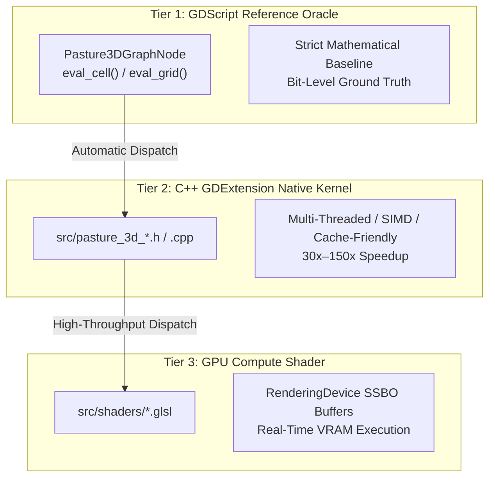

# Pasture3D Node Acceleration & Native Solver Guide

This document is the official architectural manual and expansion playbook for developing, porting, and accelerating nodes in the **Pasture3D Procedural Terrain Graph System**.

---

## 1. Architectural Overview & The 3-Tier Model

Pasture3D graphs execute through a **3-Tier Acceleration Architecture**:



### The Three Execution Tiers
1. **Tier 1 — GDScript Reference Oracle**:
   - Every node starts with a pure GDScript implementation (`_solve_gdscript` or `_eval_grid_gdscript`).
   - Serves as the ground truth oracle for automated headless parity gates.
2. **Tier 2 — C++ Native GDExtension Kernel**:
   - Implemented in `src/pasture_3d_<node_name>.h/.cpp`.
   - Optimized for cache locality, contiguous memory strides (`std::vector<float>` / `PackedFloat32Array`), zero heap allocations in inner loops, and deterministic arithmetic.
3. **Tier 3 — GPU Compute Shader**:
   - Written in GLSL Compute (`#[compute] #version 450`) under `src/shaders/`.
   - Driven by Godot's `RenderingDevice` with SSBO ping-pong buffers for real-time terrain evaluation.

---

## 2. Step-by-Step Node Acceleration Playbook

When introducing a new procedural generator, filter, or iterative simulation solver, follow these 6 steps:

### Step 1: Write the GDScript Node & Reference Oracle
Create `project/addons/pasture_3d/graph/pasture3d_graph_node_<name>.gd`:
- Inherit from `Pasture3DGraphNode`.
- Declare inputs, outputs, ports, and default parameters.
- Implement `_eval_grid_gdscript(...)` or `_solve_gdscript(...)`.

```gdscript
@tool
class_name Pasture3DGraphNodeExampleFilter
extends Pasture3DGraphNode

@export_range(0.0, 1.0, 0.05) var intensity: float = 0.5:
	set(v):
		intensity = clampf(v, 0.0, 1.0)
		emit_changed()

func op() -> StringName:
	return &"example_filter"

func role() -> Role:
	return Role.FILTER

func needs_grid() -> bool:
	return true

func input_count() -> int:
	return 2

func input_names() -> PackedStringArray:
	return PackedStringArray(["input", "mask"])

func eval_grid(p_inputs: Array, p_gw: int, p_gh: int, _p_mask, p_rect: Rect2) -> PackedFloat32Array:
	var n := p_gw * p_gh
	var in_grid: PackedFloat32Array = p_inputs[0] if (p_inputs.size() > 0 and p_inputs[0] is PackedFloat32Array) else Pasture3DGraphOps.zeros(n)
	var mask: PackedFloat32Array = p_inputs[1] if (p_inputs.size() > 1 and p_inputs[1] is PackedFloat32Array) else Pasture3DGraphOps.filled(n, 1.0)

	# Tier 2 GDExtension Dispatch (Fail-fast if missing or failed)
	if not ClassDB.class_has_method("Pasture3DUtil", "example_filter_grid"):
		push_error("[Pasture3D] Pasture3DUtil.example_filter_grid is not bound. Rebuild GDExtension.")
		return in_grid.duplicate()

	var res: PackedFloat32Array = Pasture3DUtil.example_filter_grid(in_grid, mask, p_gw, p_gh, intensity)
	if res.size() != n:
		push_error("[Pasture3D] Example filter native solve returned invalid grid size.")
		return in_grid.duplicate()

	return res
```

For algorithm prototyping, A/B testing, and CI parity benchmarks, create a corresponding `[Dev/GD]` reference node under `project/addons/pasture_3d/graph/pasture3d_graph_node_dev_<name>.gd` (`Pasture3DGraphNodeDev<Name>` with op `&"dev_<name>"`), and register it in `Pasture3DGraphNodeRegistry._dev_entries()`. (See [PASTURE3D_GDSCRIPT_CPP_NODE_SEPARATION_SPEC.md](file:///g:/LaughingRooster/GodotExtensions/Pasture3D/PASTURE3D_GDSCRIPT_CPP_NODE_SEPARATION_SPEC.md)).


---

### Step 2: Implement the C++ Native Kernel
Create `src/pasture_3d_<name>.h` and `src/pasture_3d_<name>.cpp`:

```cpp
// src/pasture_3d_example_filter.h
#ifndef PASTURE_3D_EXAMPLE_FILTER_H
#define PASTURE_3D_EXAMPLE_FILTER_H

#include <godot_cpp/variant/packed_float32_array.hpp>

namespace godot {

PackedFloat32Array example_filter_solve(const PackedFloat32Array &p_surface,
		const PackedFloat32Array &p_mask, int p_gw, int p_gh, double p_intensity);

} // namespace godot

#endif // PASTURE_3D_EXAMPLE_FILTER_H
```

```cpp
// src/pasture_3d_example_filter.cpp
#include "pasture_3d_example_filter.h"
#include <algorithm>
#include <cmath>

using namespace godot;

PackedFloat32Array godot::example_filter_solve(const PackedFloat32Array &p_surface,
		const PackedFloat32Array &p_mask, int p_gw, int p_gh, double p_intensity) {
	const int n = p_gw * p_gh;
	PackedFloat32Array out;
	out.resize(n);
	if (p_surface.size() != n || n <= 0) return out;

	const float *src = p_surface.ptr();
	const float *msk = (p_mask.size() == n) ? p_mask.ptr() : nullptr;
	float *dst = out.ptrw();

	for (int i = 0; i < n; i++) {
		const float val = src[i];
		if (std::isfinite(val)) {
			const double m = msk ? std::clamp((double)msk[i], 0.0, 1.0) : 1.0;
			dst[i] = (float)((double)val + p_intensity * m);
		} else {
			dst[i] = val;
		}
	}
	return out;
}
```

---

### Step 3: Implement the GLSL Compute Shader
Create `src/shaders/graph_<name>.glsl`:

```glsl
#[compute]
#version 450

layout(local_size_x = 8, local_size_y = 8, local_size_z = 1) in;

layout(set = 0, binding = 0, std430) readonly buffer InHeight { float in_height[]; };
layout(set = 0, binding = 1, std430) readonly buffer InMask   { float in_mask[]; };
layout(set = 0, binding = 2, std430) buffer       OutHeight  { float out_height[]; };

layout(push_constant) uniform PushConstants {
    int grid_w;
    int grid_h;
    float intensity;
} pc;

void main() {
    ivec2 coord = ivec2(gl_GlobalInvocationID.xy);
    if (coord.x >= pc.grid_w || coord.y >= pc.grid_h) return;

    int idx = coord.y * pc.grid_w + coord.x;
    float val = in_height[idx];
    if (isnan(val) || isinf(val)) {
        out_height[idx] = val;
        return;
    }

    float m = clamp(in_mask[idx], 0.0, 1.0);
    out_height[idx] = val + pc.intensity * m;
}
```

---

### Step 4: Register GDExtension Bindings in `Pasture3DUtil`
Update `src/pasture_3d_util.h` and `src/pasture_3d_util.cpp`:

1. **Declare static wrapper in `pasture_3d_util.h`**:
   ```cpp
   static PackedFloat32Array example_filter_grid(const PackedFloat32Array &p_surface,
   		const PackedFloat32Array &p_mask, const int p_gw, const int p_gh, const double p_intensity);
   ```

2. **Implement and bind in `pasture_3d_util.cpp`**:
   ```cpp
   PackedFloat32Array Pasture3DUtil::example_filter_grid(const PackedFloat32Array &p_surface,
   		const PackedFloat32Array &p_mask, const int p_gw, const int p_gh, const double p_intensity) {
   	return godot::example_filter_solve(p_surface, p_mask, p_gw, p_gh, p_intensity);
   }

   void Pasture3DUtil::_bind_methods() {
   	...
   	ClassDB::bind_static_method("Pasture3DUtil",
   			D_METHOD("example_filter_grid", "surface", "mask", "gw", "gh", "intensity"),
   			&Pasture3DUtil::example_filter_grid);
   }
   ```

---

### Step 5: Write the Automated Parity & Benchmark Gate
Create `project/bench/Graph<Name>AccelerationGate.gd` and `.tscn`:

```gdscript
extends Node

const TOLERANCE: float = 0.0001
var _failures: int = 0

func _ready() -> void:
	print("\n=== GraphExampleAccelerationGate ===\n")
	_test_parity()
	_run_benchmarks()
	if _failures == 0:
		print("=== PASS (0 failures) ===")
		get_tree().quit(0)
	else:
		printerr("=== FAIL (%d failures) ===" % _failures)
		get_tree().quit(1)

func _test_parity() -> void:
	var gw := 128
	var gh := 128
	var n := gw * gh
	var surf := Pasture3DGraphOps.filled(n, 10.0)
	var mask := Pasture3DGraphOps.filled(n, 1.0)
	var node := Pasture3DGraphNodeExampleFilter.new()

	var gd_res: PackedFloat32Array = node._eval_grid_gdscript(surf, mask, gw, gh, 0.5)
	var cpp_res: PackedFloat32Array = Pasture3DUtil.example_filter_grid(surf, mask, gw, gh, 0.5)

	var max_diff := 0.0
	for i in range(n):
		max_diff = maxf(max_diff, absf(cpp_res[i] - gd_res[i]))

	print("Max difference |cpp - gdscript| = %.9f" % max_diff)
	if max_diff > TOLERANCE:
		printerr("FAIL: Parity violation!")
		_failures += 1
```

---

## 3. Core Architectural Rules & Best Practices

### 1. Floating-Point Precision & Bit-Level Parity
- **Consistent Precision**: Perform cellular simulation math in standard double-precision `double` accumulators during iterations, casting to `float` when storing to `PackedFloat32Array`.
- **Coordinate Conversion**: Always use `Pasture3DTerrainGraph.cell_to_world(ix, iz, gw, gh, rect)` / `graph_cell_to_world(...)` to guarantee that all procedural samplers use identical cell-center alignment.

### 2. NaN Boundary & Hole Preservation
- If a terrain grid contains holes or uninitialized cells (`NAN` or `INF`), nodes **must not** propagate NaN poisoning to valid neighbor cells.
- Always check `std::isfinite(val)` / `is_finite(val)`. In spatial blur/Laplacian filters, normalize only across finite neighbor samples.

### 3. Hydrological Monotonicity in Priority Queues
- When implementing Priority-Flood or wavefront drainage propagation, push the **monotonic spillway elevation** (`spill_elev >= spill_z`) into the min-heap.
- Apply depth limits or fill caps **after** popping to prevent downward wave inversion across flat topography.

---

## 4. Performance Standards & Benchmarks

| Node Category | Target Speedup (C++ vs GDScript) | Target Throughput ($512 \times 512$) |
| :--- | :--- | :--- |
| **Generators / Cell Math** | **$30\times - 60\times$** | $< 10\text{ ms}$ |
| **Spatial / Frequency Filters** | **$40\times - 80\times$** | $< 30\text{ ms}$ |
| **Hydrology / Priority-Flood** | **$70\times - 120\times$** | $< 40\text{ ms}$ |
| **Iterative Weathering Solvers** | **$100\times - 150\times$** | $< 50\text{ ms}$ |

---

## 5. Summary of Native Accelerators in Pasture3D

| Node | C++ Native Kernel | Compute Shader | Bindings in `Pasture3DUtil` |
| :--- | :--- | :--- | :--- |
| `ErosionHydraulic` | `src/pasture_3d_erosion_hydraulic.*` | `src/shaders/graph_solver_hydraulic.glsl` | `erosion_hydraulic_solve_grid` |
| `DepressionFilling` | `src/pasture_3d_depression_filling.*` | — | `depression_filling_grid` |
| `LakeFlooding` | `src/pasture_3d_lake_flooding.*` | — | `lake_flooding_grid` |
| `StreamExtraction`| `src/pasture_3d_stream_extraction.*` | — | `stream_extraction_grid` |
| `ErosionThermal` | `src/pasture_3d_erosion_thermal.*` | `src/shaders/graph_filter_talus.glsl` | `erosion_thermal_solve_grid` |
| `TalusProjection` | `src/pasture_3d_erosion_thermal.*` | `src/shaders/graph_filter_talus.glsl` | `talus_projection_grid` |
| `SpectralEqualizer`| `src/pasture_3d_spectral_equalizer.*`| `src/shaders/graph_filter_spectral.glsl` | `spectral_equalizer_grid` |
| `Curvature` | `src/pasture_3d_curvature.*` | — | `curvature_grid` |
| `Warp` | `src/pasture_3d_warp.*` | — | `warp_grid` |
