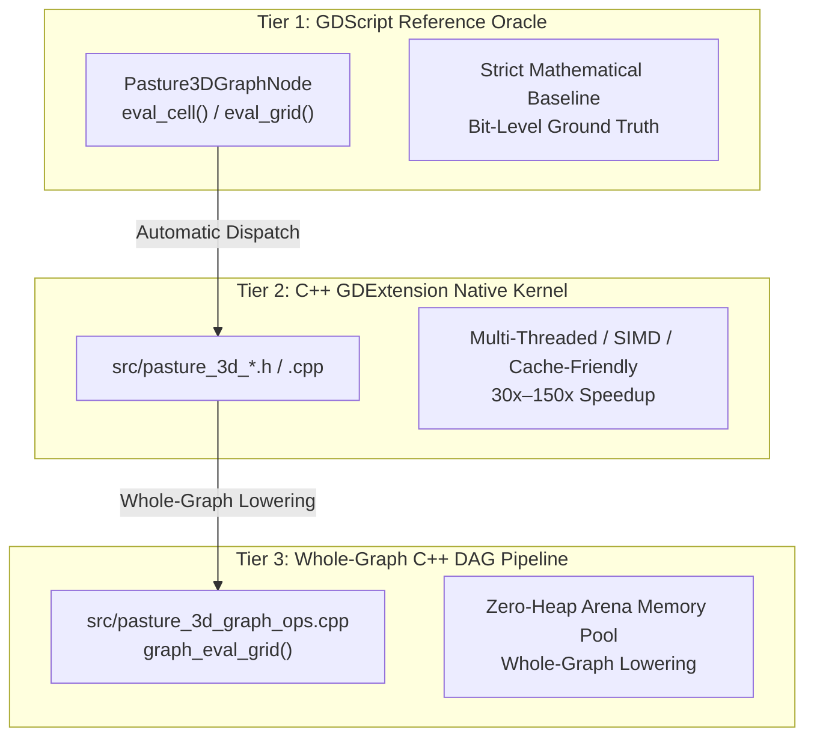

# Pasture3D Node Development & Native Acceleration Guide

This document is the official architectural manual and step-by-step expansion playbook for developing, porting, and accelerating nodes in the **Pasture3D Procedural Terrain Graph System**.

---

## 1. Architectural Overview & The 3-Tier Model

Pasture3D graphs execute through a **3-Tier Acceleration Architecture**:



### The Execution Tiers
1. **Tier 1 — GDScript Reference Oracle**:
   - Every node has a pure GDScript implementation (`_solve_gdscript` or `eval_cell` / `eval_grid`).
   - Serves as the ground truth oracle for automated headless parity gates.
2. **Tier 2 — C++ Native GDExtension Kernel**:
   - Implemented in `src/pasture_3d_<node_name>.h/.cpp`.
   - Optimized for cache locality, contiguous memory strides (`PackedFloat32Array` / `std::vector<float>`), multi-threading via `Pasture3DThreadPool`, and deterministic arithmetic.
3. **Tier 3 — Whole-Graph Native Lowering & Scratch Memory Arena**:
   - Flat SSA bytecode evaluation in `src/pasture_3d_graph_ops.cpp` (`Pasture3DUtil.graph_eval_grid`).
   - Evaluates entire multi-branch DAGs in C++ without returning to GDScript between nodes.
   - Reference-counted scratch memory pool dynamically reuses intermediate buffers with **0 heap allocations during live brush painting**.

---

## 2. Step-by-Step Node Implementation Playbook

When introducing a new procedural generator, filter, modifier, or iterative simulation solver, follow these 7 steps:

---

### Step 1: Create the GDScript Node Class
Create `project/addons/pasture_3d/graph/pasture3d_graph_node_<name>.gd`:
- Inherit from `Pasture3DGraphNode`.
- Declare `@export` parameters with range limits and setter notifications (`emit_changed()` or `_param_changed()`).
- Declare `op() -> StringName`, `role() -> Role`, `needs_grid() -> bool`, and port configurations (`input_count()`, `input_names()`, `output_count()`, `output_names()`).
- Implement `eval_cell()` (for point operators) or `eval_grid()` / `eval_grid_channels()` (for spatial filters and solvers).

```gdscript
@tool
class_name Pasture3DGraphNodeExampleFilter
extends Pasture3DGraphNode

@export_range(0.0, 1.0, 0.05) var intensity: float = 0.5:
	set(v):
		intensity = clampf(v, 0.0, 1.0)
		emit_changed()

func op() -> StringName:
	return &"example_filter"

func role() -> Role:
	return Role.FILTER

func needs_grid() -> bool:
	return true

func input_count() -> int:
	return 2

func input_names() -> PackedStringArray:
	return PackedStringArray(["input", "mask"])

func eval_grid(p_inputs: Array, p_gw: int, p_gh: int, _p_mask, p_rect: Rect2) -> PackedFloat32Array:
	var n := p_gw * p_gh
	var in_grid: PackedFloat32Array = p_inputs[0] if (p_inputs.size() > 0 and p_inputs[0] is PackedFloat32Array) else Pasture3DGraphOps.zeros(n)
	var mask: PackedFloat32Array = p_inputs[1] if (p_inputs.size() > 1 and p_inputs[1] is PackedFloat32Array) else Pasture3DGraphOps.filled(n, 1.0)

	# Tier 2 GDExtension Dispatch (Fail-fast if missing or failed)
	if not ClassDB.class_has_method("Pasture3DUtil", "example_filter_grid"):
		push_error("[Pasture3D] Pasture3DUtil.example_filter_grid is not bound. Rebuild GDExtension.")
		return in_grid.duplicate()

	var res: PackedFloat32Array = Pasture3DUtil.example_filter_grid(in_grid, mask, p_gw, p_gh, intensity)
	if res.size() != n:
		push_error("[Pasture3D] Example filter native solve returned invalid grid size.")
		return in_grid.duplicate()

	return res
```

---

### Step 2: Register in Node Palette
In [`project/addons/pasture_3d/graph/pasture3d_graph_node_registry.gd`](file:///g:/LaughingRooster/GodotExtensions/Pasture3D/project/addons/pasture_3d/graph/pasture3d_graph_node_registry.gd):
1. Preload the script:
   ```gdscript
   const ExampleFilterScript = preload("res://addons/pasture_3d/graph/pasture3d_graph_node_example_filter.gd")
   ```
2. Add an entry to `entries()`:
   ```gdscript
   {"op": &"example_filter", "title": "Example Filter", "role": "Filter", "script": ExampleFilterScript, "tags": ["example", "filter", "detail"], "description": "Applies custom filtering to terrain elevation."}
   ```

---

### Step 3: Implement the C++ Native Kernel
Create `src/pasture_3d_<name>.h` and `src/pasture_3d_<name>.cpp`:

```cpp
// src/pasture_3d_example_filter.h
#ifndef PASTURE_3D_EXAMPLE_FILTER_H
#define PASTURE_3D_EXAMPLE_FILTER_H

#include <godot_cpp/variant/packed_float32_array.hpp>

namespace godot {

PackedFloat32Array example_filter_solve(const PackedFloat32Array &p_surface,
		const PackedFloat32Array &p_mask, int p_gw, int p_gh, double p_intensity);

} // namespace godot

#endif // PASTURE_3D_EXAMPLE_FILTER_H
```

```cpp
// src/pasture_3d_example_filter.cpp
#include "pasture_3d_example_filter.h"
#include "pasture_3d_thread_pool.h"
#include <algorithm>
#include <cmath>

using namespace godot;

PackedFloat32Array godot::example_filter_solve(const PackedFloat32Array &p_surface,
		const PackedFloat32Array &p_mask, int p_gw, int p_gh, double p_intensity) {
	const int n = p_gw * p_gh;
	PackedFloat32Array out;
	out.resize(n);
	if (p_surface.size() != n || n <= 0) return out;

	const float *src = p_surface.ptr();
	const float *msk = (p_mask.size() == n) ? p_mask.ptr() : nullptr;
	float *dst = out.ptrw();

	Pasture3DThreadPool::parallel_for_rows(p_gh, 16, [&](int z0, int z1) {
		for (int iz = z0; iz < z1; iz++) {
			const int row = iz * p_gw;
			for (int ix = 0; ix < p_gw; ix++) {
				const int i = row + ix;
				const float val = src[i];
				if (std::isfinite(val)) {
					const double m = msk ? std::clamp((double)msk[i], 0.0, 1.0) : 1.0;
					dst[i] = (float)((double)val + p_intensity * m);
				} else {
					dst[i] = val;
				}
			}
		}
	});

	return out;
}
```

---

### Step 4: Expose Static Binding in `Pasture3DUtil`
In `src/pasture_3d_util.h` and `src/pasture_3d_util.cpp`:

1. **Header declaration** (`src/pasture_3d_util.h`):
   ```cpp
   static PackedFloat32Array example_filter_grid(const PackedFloat32Array &p_surface,
   		const PackedFloat32Array &p_mask, const int p_gw, const int p_gh, const double p_intensity);
   ```

2. **Binding registration** (`src/pasture_3d_util.cpp`):
   ```cpp
   PackedFloat32Array Pasture3DUtil::example_filter_grid(const PackedFloat32Array &p_surface,
   		const PackedFloat32Array &p_mask, const int p_gw, const int p_gh, const double p_intensity) {
   	return godot::example_filter_solve(p_surface, p_mask, p_gw, p_gh, p_intensity);
   }

   void Pasture3DUtil::_bind_methods() {
   	...
   	ClassDB::bind_static_method("Pasture3DUtil",
   			D_METHOD("example_filter_grid", "surface", "mask", "gw", "gh", "intensity"),
   			&Pasture3DUtil::example_filter_grid);
   }
   ```

---

### Step 5: Hook into Whole-Graph C++ Lowering & Memory Pool

To enable the node to run at zero-heap-allocation native speed inside whole DAGs:

1. **Add Opcode in `src/pasture_3d_graph_ops.h`**:
   ```cpp
   enum GraphCellOpType {
       ...
       GRAPH_OP_EXAMPLE_FILTER = 34,
   };
   ```

2. **Handle Opcode in `src/pasture_3d_graph_ops.cpp`**:
   ```cpp
   case GRAPH_OP_EXAMPLE_FILTER: {
       PackedFloat32Array in_arr = get_grid_packed(in0[s]);
       PackedFloat32Array in_mask = get_grid_packed(in1[s]);
       PackedFloat32Array res = example_filter_solve(in_arr, in_mask, p_gw, p_gh, params[s]);
       if (res.size() == n) std::copy_n(res.ptr(), n, g_ptr);
   } break;
   ```

3. **Register in `compile_graph_program()` & `native_supported()`** ([`pasture3d_terrain_graph.gd`](file:///g:/LaughingRooster/GodotExtensions/Pasture3D/project/addons/pasture_3d/graph/pasture3d_terrain_graph.gd)):
   - In `compile_graph_program()`, extract parameters using safe closures `_f` (float) and `_i` (int):
     ```gdscript
     &"example_filter":
         op_id = 34
         p0 = _f.call(&"intensity", 0.5)
     ```
   - In `native_supported()`, append `&"example_filter"` to the `SUPPORTED` array.

---

### Step 6: Create Headless Parity Gate & Scaling Benchmark
Create `project/bench/GraphExampleFilterGate.gd` and `project/bench/GraphExampleFilterGate.tscn`:

```gdscript
extends Node

const EPS := 0.0001
var _fail: int = 0

func _ready() -> void:
	print("=== GraphExampleFilterGate ===")
	_test_parity()
	if _fail == 0:
		print("=== PASS (0 failures) ===")
		get_tree().quit(0)
	else:
		printerr("=== FAIL (%d failures) ===" % _fail)
		get_tree().quit(1)

func _test_parity() -> void:
	var gw := 128
	var gh := 128
	var rect := Rect2(-100.0, -100.0, 200.0, 200.0)
	var g := Pasture3DTerrainGraph.new()
	var inp := Pasture3DGraphNodeNoise.new()
	var flt := Pasture3DGraphNodeExampleFilter.new(); flt.intensity = 0.75
	var out := Pasture3DGraphNodeOutput.new()

	g.nodes = [inp, flt, out]
	g.connections = [
		PackedInt32Array([0, 0, 1, 0]),
		PackedInt32Array([1, 0, 2, 0]),
	]

	var prog := g.compile_graph_program()
	var native_res := Pasture3DUtil.graph_eval_grid(prog, gw, gh, rect, PackedFloat32Array())
	var eval_res := g.evaluate(gw, gh, rect, null, PackedFloat32Array())

	var diff := 0.0
	for i in range(gw * gh):
		diff = maxf(diff, absf(native_res[i] - eval_res[i]))

	print("    max |native - evaluate| = %.7f (want < %.7f)" % [diff, EPS])
	if diff > EPS:
		_fail += 1
```

---

## 3. Core Architectural Rules & Best Practices

### 3.1 Critical Lessons: The Hydraulic Solver Bug & Lowering Pitfalls

During Milestone 4 whole-graph integration, a critical bug occurred with `ErosionHydraulic` where graphs compiling with Hydraulic Erosion broke and brush strokes produced zero terrain change:

```
ERROR: res://addons/pasture_3d/graph/pasture3d_terrain_graph.gd:1013 - Invalid call. Nonexistent 'float' constructor.
```

#### Why It Happened:
1. **The `float(null)` Runtime Constructor Trap**: In GDScript, calling `float(node.get("mismatched_name"))` when a property does not exist returns `null`. Unlike loose dynamic languages that convert `null` to `0.0`, GDScript 4 throws a hard runtime error: `Nonexistent 'float' constructor`.
2. **Silent Failure & Empty Brush Returns**: The exception halted `compile_graph_program()`, causing it to catch the error or abort and return `{}`. As a result, brushes received an empty program, evaluating to flat zeros.
3. **Property Name Drift Across Layers**: The GDScript node declared `@export var erosion_speed` and `deposition_speed`, but the whole-graph lowering loop queried `dissolution_rate` and `deposition_rate` (inherited from a different simulator API).
4. **Dispatcher Inconsistency**: The standalone solver called `Pasture3DUtil.erosion_hydraulic_solve_grid_best`, whereas `pasture_3d_graph_ops.cpp` initially called `erosion_hydraulic_solve` (CPU-only), causing numerical divergence between standalone and pipeline runs.

---

### 3.2 Lowering Safety Rules & Prevention Checklist

To prevent this issue on all future nodes and solvers, adhere to these mandatory design rules:

#### 1. Always Use Defensive Property Accessors
In [`pasture3d_terrain_graph.gd`](file:///g:/LaughingRooster/GodotExtensions/Pasture3D/project/addons/pasture_3d/graph/pasture3d_terrain_graph.gd) `compile_graph_program()`, **NEVER** write `float(node.get("prop"))` or `int(node.get("prop"))`. Always use the safe lambda accessors with explicit fallback defaults:

```gdscript
var _f := func(p: StringName, def: float = 0.0) -> float:
	var v = node.get(p)
	return float(v) if v != null else def

var _i := func(p: StringName, def: int = 0) -> int:
	var v = node.get(p)
	return int(v) if v != null else def
```

#### 2. Cross-Layer Naming Verification Checklist
Whenever adding or modifying a node, cross-verify that the exact property identifier is identical across all four files:
- [ ] **GDScript Node Class** (`pasture3d_graph_node_<name>.gd`): `@export var my_parameter: float`
- [ ] **Lowering Compiler** (`pasture3d_terrain_graph.gd`): `pb = _f.call(&"my_parameter", default_val)`
- [ ] **Native Opcode Case** (`src/pasture_3d_graph_ops.cpp`): `p.my_parameter = params_b[s]`
- [ ] **C++ Parameter Struct** (`src/pasture_3d_<name>.h`): `double my_parameter;`

#### 3. Parameter Slot Assignment Table
Lowered parameters map to specific parallel arrays in SSA flat bytecode. Maintain slot consistency:

| Lowering Slot in GDScript | Native C++ Array in `graph_ops.cpp` | Recommended Usage |
| :--- | :--- | :--- |
| `p0` | `params[s]` | Primary scalar / Mode / Iterations |
| `pb` | `params_b[s]` | Secondary scalar / Rate / Frequency |
| `pc` | `params_c[s]` | Tertiary scalar / Gain / Exponent |
| `pd` | `params_d[s]` | Quaternary scalar / Octaves / Diffusion |
| `pe` | `params_e[s]` | Speed / Blend amount / Threshold |
| `pf` | `params_f[s]` | Speed / Angle / Falloff |
| `pg` | `params_g[s]` | Seed / Min Slope / Contrast |
| `ph` | `params_h[s]` | Auxiliary seed / Step count |
| `pj`, `pk` | `params_j[s]`, `params_k[s]` | 2D Vector offsets (`center_offset.x`, `.y`) |

#### 4. Unified Dispatcher Routing
If a solver supports GPU compute acceleration or multi-tier routing (e.g. `erosion_hydraulic_solve_best`), ensure `src/pasture_3d_graph_ops.cpp` calls the **same router function** (`_best`) as `Pasture3DUtil::<solver>_grid_best`.

---

### 3.3 General Runtime Guarantees

1. **NaN & Hole Preservation**:
   - Terrain grids can contain `NAN` representing uninitialized or cut-out brush regions.
   - Nodes **must not** propagate NaN poisoning to neighbors. Always check `std::isfinite(val)` / `is_finite(val)`. In spatial blur/Laplacian filters, normalize only across finite neighbor samples.

2. **Zero-Allocation Arena Reuse**:
   - The whole-graph evaluator uses a recycled `std::vector<float>` pool.
   - In `src/pasture_3d_graph_ops.cpp`, intermediate node outputs write directly to `g_ptr` acquired from `arena_acquire(n)`, and input buffers automatically recycle via reference counting when consumers finish.

3. **Secondary Multi-Output Channel Routing**:
   - Solvers that generate auxiliary mask channels (e.g. `sediment`, `flow`, `talus`, `shoreline`, `water_depth`) output them on port $\ge 1$.
   - The native whole-graph DAG pipeline evaluates primary height buffers (port 0). If a graph wires secondary output ports into downstream nodes, `compile_graph_program()` and `native_supported()` automatically detect `from_port > 0` and defer execution to the channel-aware GDScript evaluator.

4. **Four GRID Slots, Unlimited Driven Scalars**:
   - A compiled program carries exactly four **grid** slots, `in0..in3`. A driven **scalar** needs no grid
     slot: the evaluator reads cell 0 of the source buffer, which is the same convention the GDScript
     nodes' `eval_grid` uses (`p_inputs[k][0]`).
   - Scalar ports at index >= 4 therefore travel in a flat overflow table — `pdrv_node` / `pdrv_param` /
     `pdrv_src`, one entry per wire — and the graph keeps its acceleration. Flat, not `in4`/`in5`, so a
     node with a seventh port is not another schema change.
   - This mattered: 14 of 60 ops have more than four ports, and `noise_swiss`/`noise_jordan` expose
     `frequency` on port 4 while `dunes` exposes `sharpness`. Until 2026-08-30, wiring one Const to any of
     those cost the user **every native op in the graph**, silently.
   - The requirement is now simply that `PARAM_PORT_MAP` maps the port. An unmapped port >= 4 is a real
     grid input with nowhere to go, and `native_supported()` still declines it rather than letting the
     kernel fall back to the baked local value (`terrain_bus_merge`'s `flow` channel is the live example).
   - **So: when you add a port past the third, add its params slot to `PARAM_PORT_MAP` in the same
     commit.** `GraphAllNodeSocketsGate` section F sweeps all 105 ports on all 60 ops and fails on any the
     native path ignores.

---

### 3.4 The Two-Evaluator Trap: bugs that only exist because there is more than one evaluator

Everything in 3.1 was one bug. The bugs found on 2026-08-30 were four, and they were all the *same* bug
wearing different clothes: **a graph has three evaluators, and anything true of only one of them is a
latent defect.** The three are `evaluate()`'s native/compiled path, `evaluate()`'s folded GDScript path,
and `_eval_unfolded()` (the independent oracle). They must agree on results *and* on side effects.

#### 1. State that lives on the GDScript node does not exist on the native path

`evaluate()` tries native FIRST, and a natively-lowered graph **never calls the node object at all** —
no `eval_grid`, no cache lookup, no stale flag. Eleven solvers owned a FROZEN cache and every one of
them in the allow-list re-solved on every evaluation and never reported itself stale. It did not error;
it looked like it worked.

**Rule.** If a node owns behaviour the compiled program cannot carry — a cache, a bake, a warning it
raises about itself, anything stateful — it must override:

```gdscript
func blocks_native() -> bool:
	return evaluation == Evaluation.FROZEN
```

`native_supported()` honours this and takes the WHOLE graph off the native path. Do not solve this by
leaving the op out of the allow-list: that works by accident (it is why DLA alone escaped), it costs
every *other* node in the graph its acceleration unconditionally, and nothing records the intent.

#### 2. The evaluators disagree about what an UNWIRED port means

This is the sharpest edge in the codebase. **The GDScript path hands an unwired port a zero-filled
GRID. The compiled program passes `in = -1`, meaning ABSENT.** A kernel written as "if the pointer is
null, skip the term" silently means something different from "the value is zero" — and only on one
path.

The Salève solver read a dx/dy warp pair and skipped the perturbation unless *both* pointers were
present. One axis wired on its own is a real warp with a zero second component, so native produced no
warp where GDScript produced one. Fixed by treating a missing component as zero, not as a veto:

```cpp
if (dx_ptr || dy_ptr) {                       // EITHER axis is a real warp
	const float wdx = dx_ptr ? dx_ptr[idx] : 0.0f;
	const float wdy = dy_ptr ? dy_ptr[idx] : 0.0f;
	warp_factor += 0.5f * (wdx * n_dx[k] + wdy * n_dz[k]);
}
```

**Rule.** In every kernel, decide explicitly whether a null input port means *absent* or *zero*, and
make it match what `_input_grids()` gives the GDScript path for that same port. `GraphAllNodeSocketsGate`
sweeps every port on every node for exactly this; do not add exclusions to its `skip` map to make it
green — the exclusion IS the bug report.

#### 3. A sampled hash is not an identity

Two separate caches keyed themselves on a handful of samples of the input surface, and both served a
stale result for a *different* surface without flagging themselves:

* the graph's `_compute_node_inputs_hash` sampled `size`, `[0]` and `[n-1]`. A radial mound's corners
  are 0.0, so it hashed identically to a flat field.
* `lake_flooding` and `stream_extraction` sampled 32 cells at a fixed stride. On a mound that stride
  lands on one all-zero column.

**Rule.** Hash the whole buffer — `hash(arr.size()) ^ hash(arr)`. GDScript's `hash()` on a
`PackedFloat32Array` is a native content hash and is not the thing that will be slow about your solver.
Sampling is only acceptable where a false MATCH is harmless, and for a cache key it never is.

#### 4. `native_supported()` is graph-wide and silent

An op missing from `SUPPORTED`, a wire from a secondary port, a wire into port >= 4, or any node
returning `blocks_native()` drops **the entire graph** to GDScript. Nothing is printed. A pointwise
node like Falloff then runs per cell in script and the only symptom is that the editor feels slow.

**Rule.** Any new op with a case in `pasture_3d_graph_ops.cpp` goes into `SUPPORTED` in the same
commit. When you need to know which path a graph actually took, assert on `native_supported()` or call
`Pasture3DUtil.graph_eval_grid*` directly — a matching result proves nothing, because both paths are
supposed to agree.

#### Gate discipline that follows from all of this

* **Every criterion needs a control that fails.** Section [A] of `GraphFrozenSolverGate` asserts "FROZEN
  declines native", which is trivially true of a family that never reached native — so it also counts
  how many lower when LIVE and fails if that is not most of them.
* **A gate must distinguish "measured nothing" from "measured well."** Read a flag between the stimulus
  and the remedy, never after: sampling `_stale` below the `clear_cache()` that clears it reported all
  eleven solvers as never having gone stale.
* **Sweep the registry, not a list of names.** `GraphFrozenSolverGate` finds its subjects by looking for
  `clear_cache` + an `evaluation` property, so a solver written next month is covered the day it appears.
* **Let the fixture decide, do not exempt by name.** DLA does not read its input surface, so a surface
  change is the wrong stimulus for it. The gate probes each solver's LIVE response and picks the
  stimulus from that, with a census control so the surface path cannot go untested wholesale.
* **State a premise, do not borrow one.** `GraphNodeCachingGate` needs the GDScript path, and used to get
  there by wiring a Const into port 4 because that happened to decline native. When port 4 stopped
  declining, the premise expired. Graphs now carry `force_gdscript_evaluation` for exactly this; a gate
  that depends on an incidental limitation is a gate with an expiry date nobody wrote down.
* **Never widen a threshold to clear a red gate.** Fix the evaluator.

---

## 4. Current Registry of Native Nodes (All 29 Production Nodes)

| Category | Node Name | Op Tag | C++ Native Implementation | Whole-Graph Opcode |
| :--- | :--- | :--- | :--- | :--- |
| **Sources / Sinks** | Input | `input` | Passthrough host surface | `GRAPH_OP_INPUT` (10) |
| | Output | `output` | Pipeline terminal sink | `GRAPH_OP_OUTPUT` (12) |
| | Reroute | `reroute` | Zero-copy wire dot | `GRAPH_OP_OUTPUT` (12) |
| **Generators** | Noise (FastNoiseLite) | `noise` | `FastNoiseLite` multi-threaded sampling | `GRAPH_OP_NOISE` (1) |
| | Const | `const` | Uniform scalar field fill | `GRAPH_OP_CONST` (2) |
| | Jordan Noise | `noise_jordan` | `pasture_3d_noise_jordan.*` | `GRAPH_OP_NOISE_JORDAN` (13) |
| | Swiss Noise | `noise_swiss` | `pasture_3d_noise_swiss.*` | `GRAPH_OP_NOISE_SWISS` (14) |
| | Geological Primitive | `geological_primitive`| `pasture_3d_geological_primitive.*` | `GRAPH_OP_GEOLOGICAL_PRIMITIVE` (15) |
| | Furrows | `furrows` | `pasture_3d_furrows.*` | `GRAPH_OP_FURROWS` (16) |
| | Dunes | `dunes` | `pasture_3d_dunes.*` | `GRAPH_OP_DUNES` (17) |
| | Crater | `crater` | `pasture_3d_crater.*` | `GRAPH_OP_CRATER` (18) |
| | Domain Warp | `warp` | `pasture_3d_warp.*` | `GRAPH_OP_WARP` (19) |
| **Combiners** | Blend | `blend` | ADD, SUB, MUL, MAX, MIN math modes | `GRAPH_OP_BLEND` (3) |
| **Filters** | Terrace | `terrace` | Power-law / custom profile steps | `GRAPH_OP_TERRACE` (4) |
| | Smooth | `smooth` | Multi-pass separable Gaussian blur | `GRAPH_OP_SMOOTH` (11) |
| | Strata | `strata` | `pasture_3d_strata.*` (Tilted bedding) | `GRAPH_OP_STRATA` (20) |
| | Curve | `curve` | 256-sample baked LUT spline remap | `GRAPH_OP_CURVE` (21) |
| | Remap | `remap` | Linear soft-knee range transfer | `GRAPH_OP_REMAP` (22) |
| | Mask | `mask` | Elevation / Slope gating | `GRAPH_OP_MASK` (23) |
| | Curvature | `curvature` | `pasture_3d_curvature.*` (Hessian/Laplacian) | `GRAPH_OP_CURVATURE` (24) |
| | Talus Projection | `talus_projection` | `pasture_3d_erosion_thermal.*` | `GRAPH_OP_TALUS_PROJECTION` (25) |
| | Spectral Equalizer| `spectral_equalizer`| `pasture_3d_spectral_equalizer.*` | `GRAPH_OP_SPECTRAL_EQUALIZER` (26) |
| | Depression Filling| `depression_filling`| `pasture_3d_depression_filling.*` (Priority-Flood) | `GRAPH_OP_DEPRESSION_FILLING` (27) |
| **Solvers** | Lake Flooding | `lake_flooding` | `pasture_3d_lake_flooding.*` | `GRAPH_OP_LAKE_FLOODING` (28) |
| | Stream Extraction | `stream_extraction`| `pasture_3d_stream_extraction.*` | `GRAPH_OP_STREAM_EXTRACTION` (29) |
| | Hydraulic Erosion | `erosion_hydraulic`| `pasture_3d_erosion_hydraulic.*` | `GRAPH_OP_EROSION_HYDRAULIC` (30) |
| | Thermal Erosion | `erosion_thermal` | `pasture_3d_erosion_thermal.*` | `GRAPH_OP_EROSION_THERMAL` (31) |
| | Scree | `scree` | `pasture_3d_scree.*` | `GRAPH_OP_SCREE` (32) |
| | Fluvial Erosion | `erosion` | `pasture_3d_erosion.*` (Stream-power) | `GRAPH_OP_EROSION` (33) |
