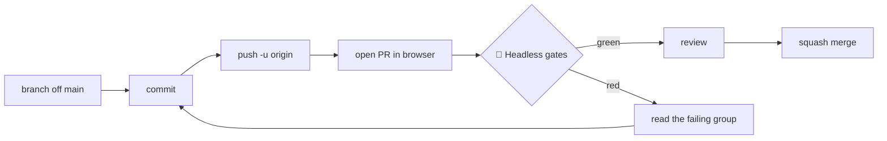

# Pasture3D PR Workflow

How a change gets into `main` now that there is a check standing in front of it.

> [!abstract] The one-sentence version
> Branch → push → open a PR → wait for **🧪 Headless gates** to go green → merge.
> The only new thing is that the gates now run on GitHub instead of only on the dev box.

---

## Why this exists

`main` has had a rule on it for a while — *"Changes must be made through a pull request"* — and it was
doing less than it looked like.

**No workflow ran on `pull_request`.** `build.yml` is inherited from Terrain3D, fails as-is, and is pinned
to manual dispatch. `pasture-libs.yml` runs on *push to main* and produces downloadable libraries; it is
an artifact producer, not a criterion. So a pull request opened with **zero checks**, and the rule cost a
contributor one click while verifying nothing.

Meanwhile the repo has 16 headless gate scenes that only ran when somebody remembered to run them.

> [!info] What changed
> `.github/workflows/gates.yml` runs those 16 scenes on every pull request. The branch rule now points at
> something real. See [[PASTURE3D_SIM_NODE_SPEC#14. Build order and gates]] for what the gates actually assert.

---

## One-time setup (maintainer)

Do these once, in order. **Order matters** — do not close the escape hatch before a green path exists.

- [ ] Merge this PR, so `gates.yml` is on `main` and GitHub knows the check exists.
- [ ] Open a throwaway PR and let it run once. Expect a fix or two: the workflow has never executed, and
      the Godot Linux asset name, `--import` support and the runner's package set are all unverified.
- [ ] Once it goes green: **Settings → Rules → Rulesets →** the ruleset on `main` **→ Require status
      checks to pass →** add **`🧪 Headless gates`**.
      The name must match the job's `name:` exactly, emoji included.
- [ ] Decide about your own bypass — see [[#About bypassing]] below.

> [!warning] Do not make the check required before it has passed once
> A required check that has never succeeded blocks every PR including the one that would fix it, and the
> only way out is the bypass you were trying to stop relying on.

---

## Day to day



### Making a change

```bash
git checkout main && git pull && git checkout -b feat/short-description
```

Commit as normal, then:

```bash
git push -u origin feat/short-description
```

`gh` is **not installed on the dev box**, so open the PR from the link git prints, or from the
*Compare & pull request* banner on the repo page. If you want the CLI:

```bash
winget install GitHub.cli
```

### Reading a failure

The workflow runs **every** gate even after one fails, then prints a tally — a suite that stops at the
first red tells you about one problem per push, which is the slowest way to fix three. Each scene gets its
own collapsible group in the log, and a failure is annotated with the scene name and its verdict.

> [!warning] A gate passes when it *says* it passed, not when it exits 0
> Several gates intermittently **segfault at shutdown, after printing a green verdict** —
> `SimPhase65SelectorGate` did it on 3 runs in 4 on 2026-08-19, and `SimPhase5Gate` and `SimPhase55Gate`
> do it too. The workflow therefore keys on the printed verdict line and reports a post-verdict crash as
> a **warning**, not a failure: a check that goes red at random is a check everybody learns to ignore.
> Fixing the crash is its own job and nobody has done it.

Reproduce locally with the same command CI uses:

```bash
"G:/LaughingRooster/GodotVersions/Godot_v4.7-stable_win64/Godot_v4.7-stable_win64_console.exe" --headless --path project bench/SimPhase6Gate.tscn
```

> [!tip] Parse-check before you push
> A GDScript parse error does not fail fast — the run spins until it is killed. One cheap command first:
> ```bash
> "G:/LaughingRooster/GodotVersions/Godot_v4.7-stable_win64/Godot_v4.7-stable_win64_console.exe" --headless --path project --check-only --script bench/YourGate.gd
> ```

---

## The demo data problem

`project/demo/data` is **46 MB of binary `.res` terrain tiles**, and the editor rewrites them constantly —
the normal state of the working tree is a few dozen of them modified.

> [!danger] Binary files cannot be merged
> `.gitattributes` now marks `*.res binary`, which implies `-merge`. Git will **stop and say so** rather
> than produce a tile that is half of each side's terrain. That is the good outcome; the resolution is
> still "pick one side and lose the other's work".

Practical consequences:

- **One person owns the demo scenes at a time.** There is no merge for `sculpting_2.tscn`'s baked data.
- **Do not sweep them into unrelated commits.** `git add -A` in this repo will hoover up whatever the
  editor touched while you were doing something else. Commit path-limited:
  ```bash
  git commit -F msg.txt -- src/ project/addons/
  ```
  (`-F`/`-m` must come *before* `--`.)
- **`CODEOWNERS` routes `/project/demo/` and `/src/` to the maintainer** so neither changes without a
  named reviewer.

---

## Adding a gate

The list CI runs lives at `project/bench/gates.txt`, deliberately next to the gates rather than inside the
workflow — adding one is a one-line change in the same commit as the gate itself.

- [ ] The scene must end with `get_tree().quit(0 if _fail == 0 else 1)`.
- [ ] Its verdict line must match `^=== .*(PASS|FAIL).*===`. Both shipped formats do — `=== PASS ===`
      and `=== PASS (0 failures) ===`.
- [ ] **Run it and watch it print a pass.** Do not trust the exit code; see the warning above.
- [ ] Add the line to `gates.txt`.

> [!caution] Only add gates you have watched go green
> A list that fails for reasons unrelated to the change is worse than no list, because the first red run
> teaches everyone to ignore the red.

Five water gates are listed in `gates.txt` as comments — not because they fail, but because nobody has run
them to a verdict. Promote one by running it and moving the line.

**Benchmarks are not gates.** `SimProfile` and `PreviewSimDiag` assert nothing and print measurements, and
`SimProfile` needs explicit go-ahead before running (see [[PASTURE3D_SIM_NODE_SPEC#11. Where it runs]]).
Neither belongs in `gates.txt`.

---

## About bypassing

You have admin bypass, and on 2026-08-19 a push used it:

```
remote: Bypassed rule violations for refs/heads/main:
remote: - Changes must be made through a pull request.
```

Keeping the bypass is defensible — the rule exists so *other people* cannot push straight to `main`, and
locking the maintainer out of their own emergency fix has costs of its own. The thing to avoid is
bypassing **without noticing**, which is what happened: it was silent at the prompt and only visible in
the push output.

> [!note] Two honest options
> - **Keep bypass, and read the push output.** GitHub logs every bypass in the ruleset's audit view.
> - **Turn off "Allow bypass" for yourself** once the gate has been green for a while. You can always
>   re-enable it in the time it takes to load Settings.
>
> `gates.yml` runs on **push to `main`** as well as on PRs, precisely so a bypassed push still gets told
> it broke something — after the fact, but told.

---

## Related

- [[PASTURE3D_SIM_NODE_SPEC]] — what the sim gates assert, and the gate-lettering ledger (§14)
- [[PASTURE3D_LAYERS_GUIDE]] — how the layer stack the demo data belongs to works
- `.github/workflows/gates.yml` — the workflow itself
- `.github/workflows/pasture-libs.yml` — Linux/macOS library builds, unrelated to gating
- `project/bench/gates.txt` — the list, and the reasoning for what is in and out
