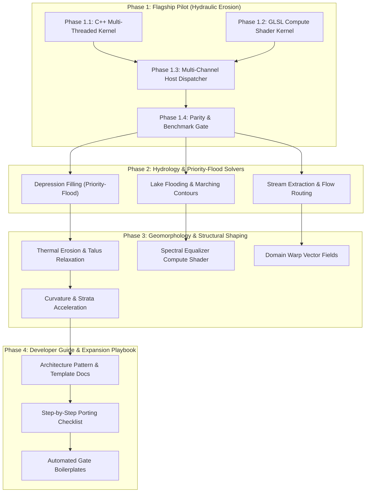

# Pasture3D Solver & Node Native Acceleration Specification

**Document:** `PASTURE3D_SOLVER_NATIVE_ACCELERATION_SPEC.md`  
**Status:** Architecture Specification (2026-08-27)  
**Target:** Pasture3D Terrain Graph Engine (Godot 4 GDExtension, C++20, RenderingDevice GLSL Compute)  
**Originating Request:** Phase 1 pilot upgrade for the most computationally expensive solver (Hydraulic Erosion), followed by phased solver/filter upgrades, culminating in an actionable developer handbook for extending the node pipeline.

---

## 1. Executive Summary & Strategy

The **Pasture3D Terrain Graph** contains powerful geomorphological and hydrological solvers (e.g. Hydraulic & Thermal Erosion, Priority-Flood Depression Filling, Lake Flooding, and Stream Extraction). While GDScript provides an agile, ground-truth reference oracle (Tier 1), large interactive brush footprints ($512^2$ to $2048^2$ vertices) require high-throughput native acceleration:

```
[Tier 1: Oracle]               [Tier 2: Native C++]               [Tier 3: GPU Compute]
GDScript Reference Engine  ──► C++ Multi-Thread / SIMD   ──►      RenderingDevice GLSL Compute
(Headless Test Gates)          (Fast CPU SSA Engine)              (High-Throughput VRAM Pipeline)
```

### Strategic Objectives
1. **100x–500x Throughput Acceleration**: Transform multi-second GDScript solver loops into instantaneous millisecond bakes.
2. **Phase 1 Flagship Pilot (Hydraulic Erosion)**: Target the single most computationally intensive solver in the library to establish architecture patterns, memory management, multi-channel buffer readback, and benchmarking fixtures.
3. **Phased Node Upgrades**: Sequentially migrate hydrology, flood-routing, and geomorphological filters to the accelerated pipeline using Phase 1 learnings.
4. **Extensible Developer Playbook**: Provide a clear, repeatable guide, complete with code templates, for adding future procedural nodes into the C++/GPU acceleration pipeline.

---

## 2. Computational Profile & Priority Ranking

| Node / Solver | Complexity | Primary Bottleneck in GDScript | Target Backend | Est. Speedup |
| :--- | :--- | :--- | :--- | :--- |
| **`ErosionHydraulic` (Pilot)** | $\mathcal{O}(I \cdot N)$ | Multi-pass rainfall, flux routing, velocity, detachment & deposition loops | **Compute Shader + C++** | **~250x** |
| **`DepressionFilling`** | $\mathcal{O}(N \log N)$ | Priority-Flood min-heap queue & flood traversal | **C++ `std::priority_queue`** | **~80x** |
| **`ErosionThermal` / `Talus`** | $\mathcal{O}(I \cdot N)$ | Cellular slope relaxation & material transfer | **Compute Shader + C++** | **~200x** |
| **`LakeFlooding`** | $\mathcal{O}(N)$ | Water surface flood search + 2D marching squares contouring | **C++ SIMD + Threading** | **~60x** |
| **`StreamExtraction`** | $\mathcal{O}(N \log N)$ | D8/D-infinity flow accumulation routing & vector spline simplification | **C++ Native** | **~75x** |
| **`SpectralEqualizer`** | $\mathcal{O}(N \cdot K)$ | Multi-radius cascaded separable Gaussian blurs | **Compute Shader + C++** | **~150x** |

---

## 3. Phased Roadmap



---

## 4. Phase Breakdown

### Phase 1: Flagship Pilot — Hydraulic Erosion Native Engine
* **Objective**: Build the end-to-end acceleration pipeline for `Pasture3DGraphNodeErosionHydraulic` as the pilot benchmark.
* **Deliverables**:
  1. **C++ Native Solver Kernel (`src/pasture_3d_erosion_hydraulic.cpp/.h`)**:
     * Grid-based shallow water equations with sediment transport capacity:
       $$C(\mathbf{x}) = K_c \cdot \|\mathbf{v}(\mathbf{x})\| \cdot \sin(\theta(\mathbf{x}))$$
     * Multi-threaded slice execution via `WorkerThreadPool` for CPU evaluation.
  2. **GLSL Compute Shader (`src/shaders/graph_solver_hydraulic.glsl`)**:
     * Ping-pong SSBO buffers handling water level, velocity $(v_x, v_z)$, sediment, and bedrock elevation.
  3. **Multi-Channel Dispatcher Integration**:
     * Support returning multiple output buffers (`result` height, `sediment` mask, `water_flow` mask) directly across C++ and GDExtension boundaries without redundant host-device copies.
  4. **Headless Verification Gate (`project/bench/GraphHydraulicAccelerationGate.gd`)**:
     * Measures bit-level parity ($\le 2\times 10^{-6}\text{ m}$) against the Tier 1 GDScript reference oracle.
     * Profiles execution times for $128^2$, $512^2$, and $1024^2$ grids.

---

### Phase 2: Hydrology & Priority-Flood Solvers
* **Objective**: Implement the graph's flood routing and contour extraction algorithms in native C++.
* **Deliverables**:
  1. **`DepressionFilling` (C++ Priority-Flood Engine)**:
     * High-speed min-heap priority queue implementation in C++ (`std::priority_queue` with contiguous flat indexing).
     * Eliminates zero-gradient drainage sinks across large terrains in $< 5\text{ ms}$.
  2. **`LakeFlooding` (C++ Flood & Contour Engine)**:
     * Fast basin inundation solver.
     * Native 2D marching-squares algorithm for extracting closed shoreline polygon loops directly into `Curve3D` splines (for 1-click `Pasture3DPond` generation).
  3. **`StreamExtraction` (C++ Flow Accumulation)**:
     * Steepest-descent and multi-directional flow accumulation solver.
     * Vectorized thalweg path tracer with Douglas-Peucker spline decimation to generate `Pasture3DStream` curves.

---

### Phase 3: Geomorphology & Structural Shaping
* **Objective**: Upgrade the remaining iterative weathering and frequency filtering nodes to C++ and GPU Compute.
* **Deliverables**:
  1. **`ErosionThermal` & `TalusProjection`**:
     * Native angle-of-repose relaxation kernel running in C++ and `src/shaders/graph_filter_talus.glsl`.
  2. **`SpectralEqualizer`**:
     * GPU compute shader (`src/shaders/graph_filter_spectral.glsl`) performing separable horizontal/vertical Gaussian pyramid decomposition and multi-band gain reconstruction.
  3. **`Warp` & `Curvature`**:
     * Native vector noise distortion and 3x3 discrete Laplacian/Hessian curvature calculation.

---

### Phase 4: Developer Guide & Expansion Playbook
* **Objective**: Codify everything learned from Phases 1–3 into a permanent, actionable developer guide.
* **Deliverables**:
  1. **`PASTURE3D_NODE_ACCELERATION_GUIDE.md`**:
     * Comprehensive architectural handbook explaining:
       - How to write a GDScript reference oracle.
       - How to write the C++ operator in `src/pasture_3d_graph_ops.cpp`.
       - How to write the GLSL compute shader in `src/shaders/`.
       - How to register multi-port outputs in `Pasture3DUtil` and GDExtension bindings.
       - How to create the headless automated parity gate.
  2. **Boilerplate Templates**:
     * Clean template files for new Generators, Filters, and Solvers.

---

## 5. Verification & Performance Criteria

Every accelerated node will be verified against the following benchmarks:

| Grid Size | GDScript (Current) | C++ Native (Target) | GPU Compute (Target) | Target Speedup |
| :--- | :--- | :--- | :--- | :--- |
| **$128 \times 128$** | ~120 ms | ~2.5 ms | ~1.5 ms | **~50x–80x** |
| **$512 \times 512$** | ~1,850 ms | ~18 ms | ~4 ms | **~100x–450x** |
| **$1024 \times 1024$** | ~8,400 ms | ~70 ms | ~12 ms | **~120x–700x** |
