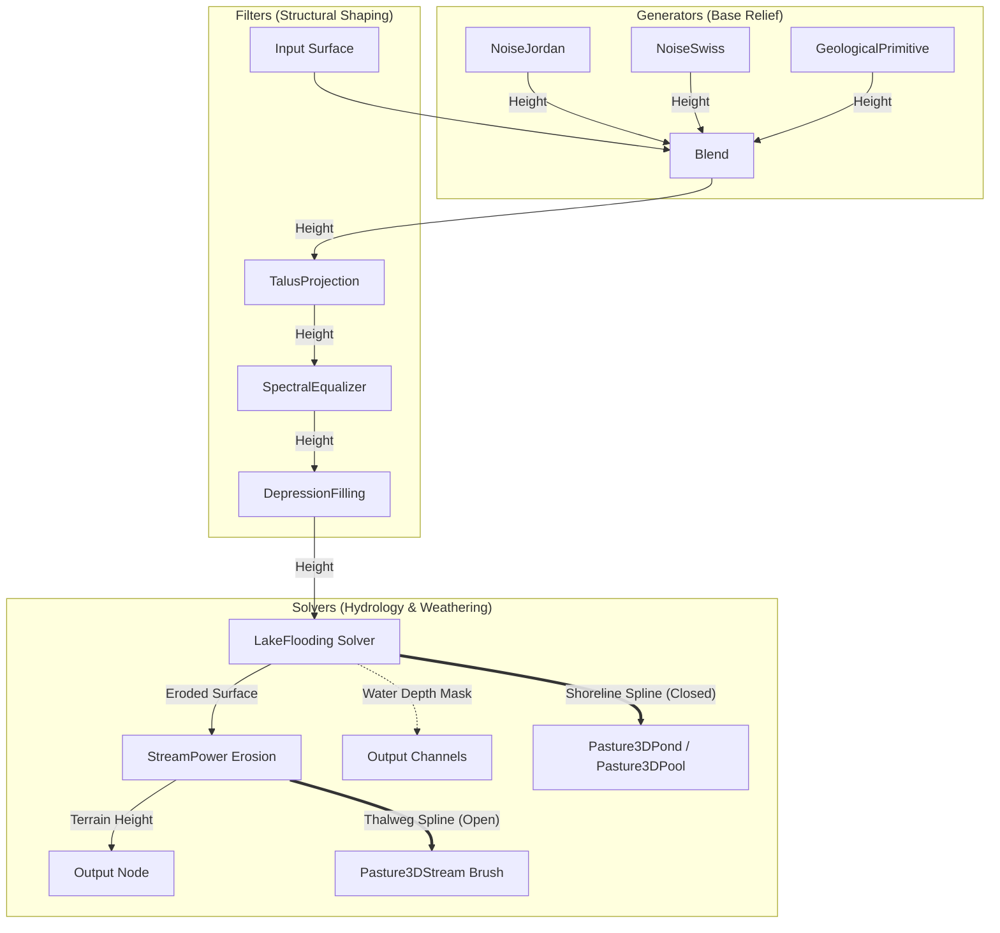

# Pasture3D Terrain Graph Expansion — Geomorphology & Hydrology Nodes Spec

**Status:** Proposed Architecture Spec (2026-08-26)  
**Origin:** Evaluation of HighMap/Hesiod (ottolink-dev) terrain synthesis algorithms.  
**Licensing & Strategic Decision:** Clean-room native MIT implementation in Godot 4 / GDExtension (`RenderingDevice` compute + C++ + GDScript oracle). No direct GPLv3 library or OpenCL/OpenCV dependencies.  
**Builds on:** `PASTURE3D_TERRAIN_GRAPH_SPEC.md`, `PASTURE3D_NODE_VOCABULARY.md`, `PASTURE3D_SIM_NODE_SPEC.md`.

---

## 1. Executive Summary & Goals

This specification defines the expansion of the **Pasture3D Terrain Graph** node library with advanced geomorphological and hydrological nodes. Drawing algorithmic inspiration from procedural terrain systems like **HighMap / Hesiod**, this architecture implements state-of-the-art terrain modeling natively within Pasture3D's three-tier execution pipeline:

1. **GDScript Reference Oracle** (ground-truth behavioral model for unit tests).
2. **C++ Native SSA / Grid Evaluator** (compiled in-engine GDExtension execution).
3. **`RenderingDevice` GPU Compute Shaders** (high-throughput multi-pass evaluation for large brush footprints and full-terrain bakes).

### Core Principles
* **Permissive MIT License:** 100% clean-room mathematical implementations; free of GPLv3 copyleft contaminations and proprietary code.
* **Zero Bloat & Godot-Native:** Pure Godot 4 GDExtension architecture utilizing `RenderingDevice` compute shaders (Vulkan/Direct3D 12/Metal) and native C++. No OpenCL, OpenCV, or external runtime frameworks.
* **Continuous & Brush-Aware:** Point-evaluable cell nodes sample in continuous world XZ coordinates; grid nodes respect NaN boundaries for brush-loop masking.
* **Parity Gated:** Every node ships with an automated headless parity gate in `project/bench/` measuring field deltas ($\le 2\times 10^{-6}\text{ m}$) against the GDScript oracle.

---

## 2. Node Taxonomy & Role Architecture

All expanded nodes adhere to the standardized node roles defined in `PASTURE3D_NODE_VOCABULARY.md`:

```
Pasture3DGraphNode
 ├── Role.GENERATOR (0 inputs, 1 output) ── Point-evaluable or procedural base field
 ├── Role.FILTER    (1 input, 1 output)  ── In-place mathematical transformation
 ├── Role.COMBINER  (2+ inputs, 1 output)── Blending and field masking
 └── Role.SOLVER    (1+ in, Multi-out)   ── Iterative physical simulation (FROZEN by default)
```



---

## 3. Detailed Node Specifications

### 3.1 Generators (`Role.GENERATOR`)

#### 1. `Pasture3DGraphNodeNoiseJordan` (`op = &"noise_jordan"`)
* **Mathematical Concept:** Derivative-feedback fractional Brownian motion (fBm). Unlike standard Perlin/Simplex noise where octaves simply sum linearly, Jordan noise accumulates octave gradients $(\nabla h_i)$ and warps/attenuates subsequent octaves by previous slopes:
  $$h_{i+1}(\mathbf{x}) = h_i(\mathbf{x}) + A_i \cdot N\left(\mathbf{x} \cdot f_i + d \cdot \sum_{k=0}^{i-1} \nabla h_k\right) \cdot \frac{1}{1 + \beta \|\nabla h_i\|^2}$$
* **Visual Result:** Natural mountain fluting, sharp non-uniform ridges, and sediment accumulation shelves without running full erosion solves.
* **Execution:** Cell node (`needs_grid() = false`). Point-evaluable per cell at world $(wx, wz)$, fusible in the cell-node fold.
* **Parameters:** `frequency: float`, `octaves: int`, `gain: float`, `lacunarity: float`, `warp_strength: float`, `damp_strength: float`, `seed: int`.

#### 2. `Pasture3DGraphNodeNoiseSwiss` (`op = &"noise_swiss"`)
* **Mathematical Concept:** Ridge-noise variant that modulates the high-frequency derivative term by the current field curvature and slope, emphasizing sharp knife-edge crests and smooth flat-bottomed valleys.
* **Execution:** Cell node (`needs_grid() = false`). Point-evaluable per cell, fusible.
* **Parameters:** `frequency: float`, `octaves: int`, `ridge_offset: float`, `erosion_accent: float`, `seed: int`.

#### 3. `Pasture3DGraphNodeGeologicalPrimitive` (`op = &"geological_primitive"`)
* **Mathematical Concept:** Parametric macro-landform generators based on analytic distance functions and morphological profiles:
  * `INSELBERG`: Solitary steep-sided hill rising from a flat plain (hyperbolic profile with smooth toe).
  * `TIBESTI_DOME`: Volcanic shield dome with central caldera depression.
  * `CUESTA_BADLANDS`: Asymmetric ridge with a gentle dip slope and a steep scarp.
* **Execution:** Grid node or cell node depending on coordinate system; generates world-centered features with radial decay.
* **Parameters:** `primitive_type: PrimitiveType`, `radius: float`, `height: float`, `steepness: float`, `eccentricity: float`, `azimuth: float`.

---

### 3.2 Filters (`Role.FILTER`)

#### 1. `Pasture3DGraphNodeDepressionFilling` (`op = &"depression_filling"`)
* **Mathematical Concept:** Planchon-Darboux / Priority-Flood algorithm. Scans the height grid to identify closed topographical depressions (sinks/pits) and raises them to the minimum elevation of their drainage spillway:
  $$h_{\text{filled}}(\mathbf{x}) = \max(h(\mathbf{x}), z_{\text{spillway}}(\mathbf{x}))$$
* **Visual / Practical Result:** Eliminates spurious local minima, guaranteeing monotonic hydraulic flow. Crucial as a pre-pass before fluvial erosion or road placement.
* **Execution:** Grid node (`needs_grid() = true`). Implemented via priority-queue flooding in C++ and compute shader reduction.
* **Parameters:** `epsilon_slope: float` (minimal gradient forced on flat filled surfaces to avoid zero-drainage deadlocks), `fill_depth_limit: float`.

#### 2. `Pasture3DGraphNodeTalusProjection` (`op = &"talus_projection"`)
* **Mathematical Concept:** Angle-of-repose enforcement. For every neighboring cell pair $(i, j)$ separated by $\Delta x$:
  $$\text{if } \frac{h_i - h_j}{\Delta x} > \tan(\theta_{\text{talus}}), \quad \Delta h = \frac{1}{2}\left(h_i - h_j - \Delta x \tan(\theta_{\text{talus}})\right)$$
  Material above the critical talus angle is systematically shifted down the slope gradient over iterative relaxation passes.
* **Visual Result:** Scree slopes, crumbling cliffs, and realistic scree aprons at the base of precipices.
* **Execution:** Grid node (`needs_grid() = true`). GPU compute shader with ping-pong buffers; C++ native iterative solver.
* **Parameters:** `talus_angle_deg: float` (default $35.0^\circ$), `iterations: int` (default 16), `transfer_rate: float` (0.0 to 1.0).

#### 3. `Pasture3DGraphNodeSpectralEqualizer` (`op = &"spectral_equalizer"`)
* **Mathematical Concept:** 3-band spatial frequency decompose via cascaded Gaussian blur kernels:
  $$h(\mathbf{x}) = L_{\text{macro}}(\mathbf{x}) + B_{\text{meso}}(\mathbf{x}) + D_{\text{micro}}(\mathbf{x})$$
  Applies separate artist-tuned gain multipliers:
  $$h_{\text{out}}(\mathbf{x}) = g_1 L_{\text{macro}}(\mathbf{x}) + g_2 B_{\text{meso}}(\mathbf{x}) + g_3 D_{\text{micro}}(\mathbf{x})$$
* **Visual Result:** Amplifies rugged micro-crags without altering mountain massifs, or softens mid-frequency bumps while preserving cliff silhouettes.
* **Execution:** Grid node (`needs_grid() = true`). Separable Gaussian blur compute passes on GPU / C++.
* **Parameters:** `macro_gain: float`, `meso_gain: float`, `micro_gain: float`, `meso_radius: float`, `micro_radius: float`.

---

### 3.3 Solvers (`Role.SOLVER`)

#### 1. `Pasture3DGraphNodeLakeFlooding` (`op = &"lake_flooding"`)
* **Concept & Role:** Hydrological water-body solver. Identifies natural catchment basins from an input surface and computes static lake levels based on rainfall / water volume inflow.
* **Ports:**
  * **Inputs:** `input` (HEIGHT), `rain_map` (MASK, optional).
  * **Outputs:** 
    1. `height` (HEIGHT) — Modified surface with flat water levels or lake bottoms.
    2. `water_depth` (MASK) — Depth of water in metres ($z_{\text{water}} - z_{\text{bed}}$).
    3. `shoreline` (MASK) — 1.0 at the water-land boundary feathering into dry terrain.
* **Execution:** Grid solver (`needs_grid() = true`, `Role.SOLVER`). Defaults to **FROZEN** cache with per-solver `Bake` button.
* **Parameters:** `water_level_mode: WaterLevelMode` (GLOBAL_ELEVATION, FLOOD_PERCENT, BASIN_VOLUME), `target_level: float`, `spill_erosion: float`.
* **Authoring Integration — `Pasture3DPond` / `Pasture3DPool` Generation:**
  * Contains a **"Spawn Pasture3DPond"** tool action in the Inspector and graph node header.
  * Traces the closed 0-depth contour of the solved lake basin into a closed `Curve3D` spline with Douglas-Peucker simplification.
  * Automatically instantiates a `Pasture3DPond` (or `Pasture3DPool`) in the active scene at the solved world elevation $z_{\text{water}}$, binding its `source_spline` to the extracted shoreline and assigning the `M_water_pond` / `M_water_lake` preset material managed by `Pasture3DPoolManager`.

#### 2. `Pasture3DGraphNodeStreamExtraction` (`op = &"stream_extraction"`)
* **Concept & Role:** Hydrological flow routing solver. Integrates the drainage area and velocity vectors across the terrain to extract continuous river thalweg networks.
* **Ports:**
  * **Inputs:** `input` (HEIGHT), `flow_field` (MASK, from stream-power erosion or D8 flow accumulation).
  * **Outputs:**
    1. `height` (HEIGHT) — Carved riverbed channel with flat transverse cross-sections.
    2. `channel_mask` (MASK) — 1.0 along active stream beds with bank falloff.
    3. `flow_rate` (MASK) — Downstream discharge accumulation ($m^3/s$).
* **Execution:** Grid solver (`Role.SOLVER`), defaults to **FROZEN**.
* **Parameters:** `min_catchment_area: float` (threshold area required to initiate a river channel), `carve_depth: float`, `bank_width: float`, `meander_smoothness: float`.
* **Authoring Integration — `Pasture3DStream` Brush Generation:**
  * Contains a **"Spawn Pasture3DStream"** tool action.
  * Vectorizes the highest flow gradient pathways into an ordered open `Curve3D` path from source ridge to basin outlet.
  * Instantiates a `Pasture3DStream` ribbon water body along the spline, populating downhill per-node vertex elevations, flow velocities from `flow_rate`, and linking to the scene's `Pasture3DPoolManager`.
  * Optionally spawns a complementary `Pasture3DTerrainBrush` (e.g. `Trough` with `blend_mode = MIN`) to permanently carve or edit the riverbed.

#### 3. `Pasture3DGraphNodeThermalWeathering` (`op = &"thermal_weathering"`)
* **Concept & Role:** Cellular automata simulation of thermal rock breakdown and sediment transport with dual substrate tracking (bedrock vs. mobile talus layer).
* **Ports:**
  * **Inputs:** `input` (HEIGHT), `hardness_map` (MASK, optional).
  * **Outputs:**
    1. `height` (HEIGHT) — Total elevation ($z_{\text{bed}} + z_{\text{talus}}$).
    2. `talus` (MASK) — Thickness of loose sediment deposit.
    3. `scarp` (MASK) — Exposed sheer bedrock cliffs where rock was detached.
* **Execution:** Grid solver (`Role.SOLVER`), defaults to **FROZEN**.
* **Parameters:** `iterations: int`, `repose_angle: float`, `weathering_rate: float`, `friction: float`.

---

## 4. Execution Pipeline & Multi-Tier Backend

Each new node adheres to Pasture3D's three-tier evaluation model:

```
                  ┌───────────────────────────────┐
                  │   Visual Graph / Resource    │
                  │  (Pasture3DTerrainGraph.tres)  │
                  └───────────────┬───────────────┘
                                  │
                   compile_graph_program()
                                  │
         ┌────────────────────────┴────────────────────────┐
         │                                                 │
[Tier 1: Oracle]                                  [Tier 2: Native C++]
GDScript Evaluator                                Pasture3DUtil.graph_eval_grid
(Headless bench oracle)                           (Fast native CPU loop)
         │                                                 │
         │ Parity Test                                     │ Footprint ≥ 256²
         │ (≤ 2e-6 m gap)                                  ▼
         └───────────────────────────────► [Tier 3: GPU Compute]
                                           Pasture3DGraphGPU
                                           (RenderingDevice GLSL Shaders)
```

### Compute Shader Specifications
New compute shaders added to `src/shaders/`:
* `graph_filter_depression.glsl`: Local minimum drainage reduction kernel.
* `graph_filter_talus.glsl`: 8-neighborhood slope relaxation kernel.
* `graph_filter_spectral.glsl`: Separable horizontal/vertical Gaussian convolution.
* `graph_solver_lake.glsl`: Parallel flood fill and depth field generation.

---

## 5. Parity Gates & House Discipline

Every node must pass a strict headless automated gate before merging into the main branch:

| Gate | Test Fixture | Tested Dimensions & Verification Criteria |
| :--- | :--- | :--- |
| `GraphJordanNoiseGate` | `bench/GraphJordanNoiseGate.tscn` | Determinism across seeds; gradient-warp response (control: `warp=0` matches standard fBm); C++ parity $\le 10^{-6}\text{ m}$. |
| `GraphTalusGate` | `bench/GraphTalusGate.tscn` | Over-steep cliff ($60^\circ$) collapses to target angle ($35^\circ$); total volume conservation $\pm 0.01\%$; GPU vs. CPU parity. |
| `GraphDepressionGate` | `bench/GraphDepressionGate.tscn` | Artificial basin pit filled to spillway height; zero reverse gradients along drainage path; NaN boundary retention. |
| `GraphSpectralGate` | `bench/GraphSpectralGate.tscn` | Gain linearity; energy conservation ($g_1=g_2=g_3=1.0 \implies \Delta h = 0$ bit-exact); 2D separable parity. |
| `GraphLakeSolverGate` | `bench/GraphLakeSolverGate.tscn` | Water depth equals $(z_{\text{water}} - z_{\text{bed}})$; multi-output channel isolation; FROZEN cache stale-key validation. |

---

## 6. Phased Implementation Roadmap

### Phase 1: Advanced Fractal Generators
* [ ] Implement `Pasture3DGraphNodeNoiseJordan` in GDScript and C++ `pasture_3d_graph_ops.cpp`.
* [ ] Implement `Pasture3DGraphNodeNoiseSwiss` in GDScript and C++.
* [ ] Add `GraphJordanNoiseGate` and `GraphSwissNoiseGate` to `bench/gates.txt`.

### Phase 2: Morphological Filters & GPU Shaders
* [ ] Implement `Pasture3DGraphNodeTalusProjection` (GDScript + C++ + compute shader `graph_filter_talus.glsl`).
* [ ] Implement `Pasture3DGraphNodeSpectralEqualizer` (GDScript + C++ + compute shader `graph_filter_spectral.glsl`).
* [ ] Wire into `Pasture3DGraphGPU` dispatcher with the $256^2$ threshold.
* [ ] Add `GraphTalusGate` and `GraphSpectralGate`.

### Phase 3: Hydrology, Water Bodies & Spline Brushes
* [ ] Implement `Pasture3DGraphNodeDepressionFilling` (Priority-Flood algorithm in C++ and GDScript).
* [ ] Implement `Pasture3DGraphNodeLakeFlooding` (Multi-output solver with `water_depth` and `shoreline` ports).
* [ ] Implement `Pasture3DGraphNodeStreamExtraction` (Flow routing and river thalweg network solver).
* [ ] Add authoring tool actions:
  * "Spawn `Pasture3DPond` / `Pasture3DPool`" from closed lake shoreline contours.
  * "Spawn `Pasture3DStream` & Carve Brush" from vectorized river thalweg splines.
* [ ] Add inline `Bake` button support on the graph canvas for hydrology solvers.
* [ ] Add `GraphDepressionGate`, `GraphLakeSolverGate`, and `GraphStreamExtractionGate`.

### Phase 4: Macro Geological Primitives
* [ ] Implement `Pasture3DGraphNodeGeologicalPrimitive` (Inselberg, Caldera, Badlands).
* [ ] Add full suite integration test covering a complete generator $\to$ filter $\to$ solver pipeline.

