# Layer System Architecture

This document describes the non-destructive layer system architecture introduced to Terrain3D, enabling artists to apply procedural and stamp-based modifications to terrain maps without permanently altering the base data.

## Overview

The layer system enables:
- Non-destructive editing of height, control, and color maps
- Multiple layer types with different generation strategies (stamps, curves, local nodes)
- Real-time compositing with caching and dirty-tracking for performance
- Blending modes (Add, Subtract, Replace) with intensity and feather controls
- Coverage areas and alpha masks for precise control
- Layer groups for synchronized multi-region editing

## System Architecture with Layer System Changes

This diagram shows the complete Terrain3D architecture with the **new layer system components highlighted in green**. Components and connections shown in standard colors were part of the original architecture.

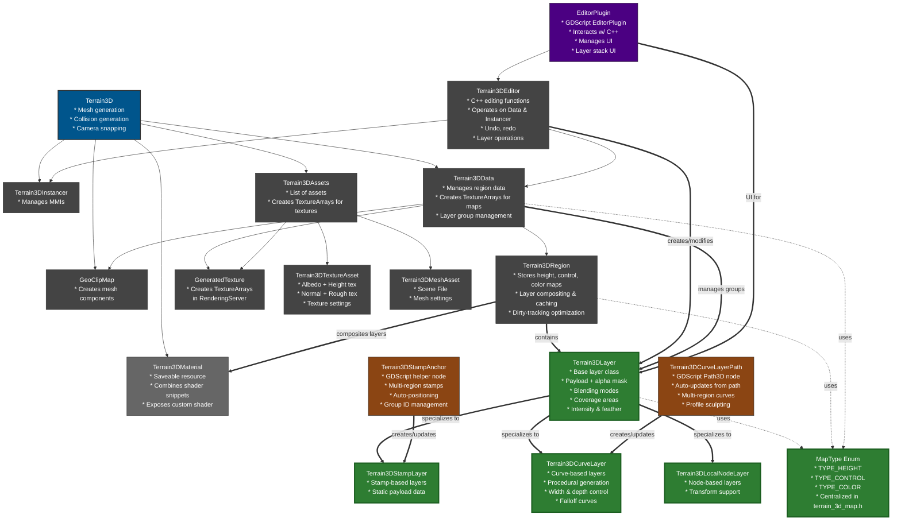

**Key Changes:**
- **Terrain3DLayer hierarchy** (new): Base class with three specialized layer types
- **MapType refactoring** (new): Standalone enum in `terrain_3d_map.h` for better organization
- **Layer compositing** (new): Regions now composite base maps with layers on-demand
- **GDScript helpers** (new): StampAnchor and CurveLayerPath nodes for artist-friendly workflows
- **Layer group management** (new): Terrain3DData manages group IDs for multi-region coordination
- **Dirty-tracking optimization** (new): Incremental re-composition of modified areas

## Layer Class Hierarchy

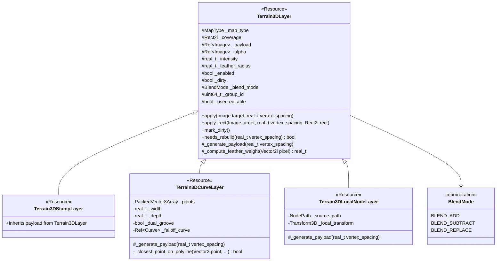

## Layer Compositing System

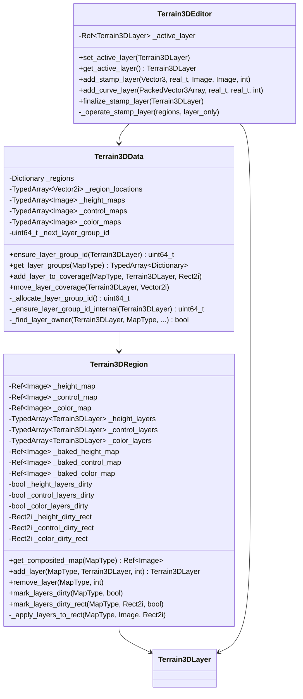

## Layer Compositing Workflow

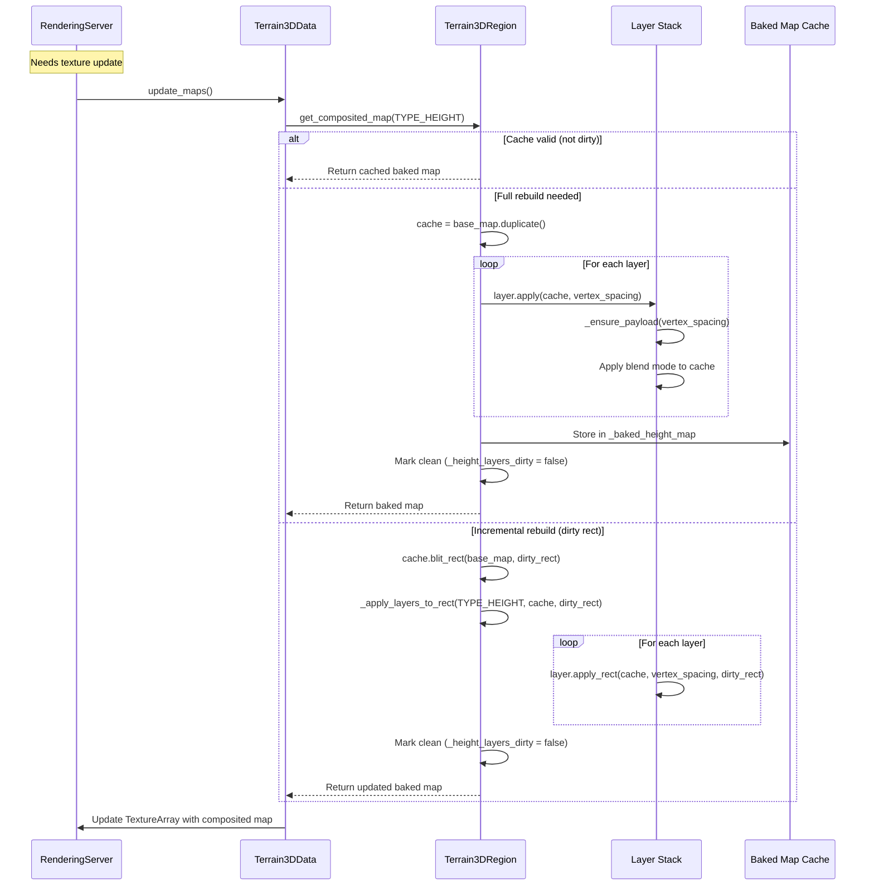

## Layer Blending Algorithm

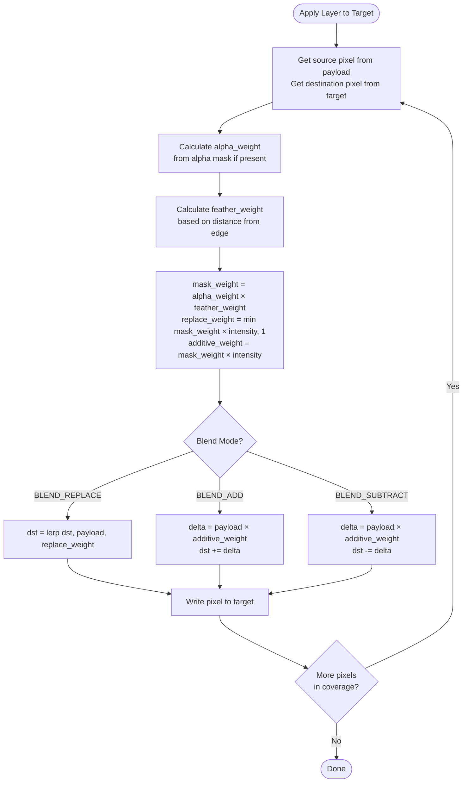

## Layer Group System

The layer group system enables multiple regions to share the same layer instance, allowing stamps and curves to span region boundaries seamlessly.

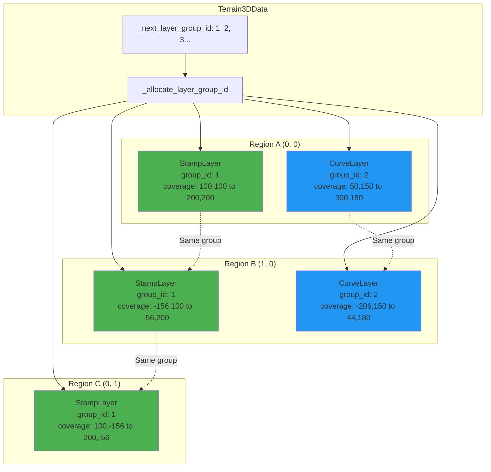

## Dirty Tracking & Optimization

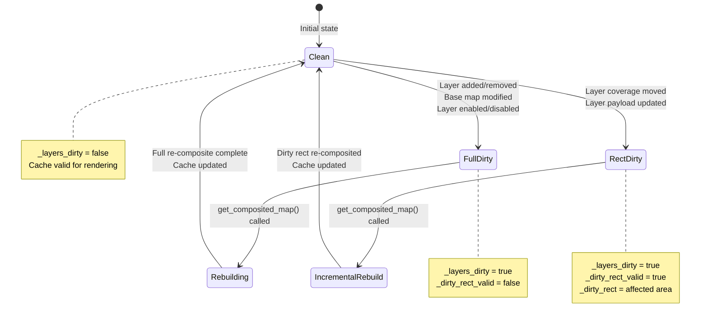

## GDScript Helper Nodes

### Terrain3DStampAnchor Workflow

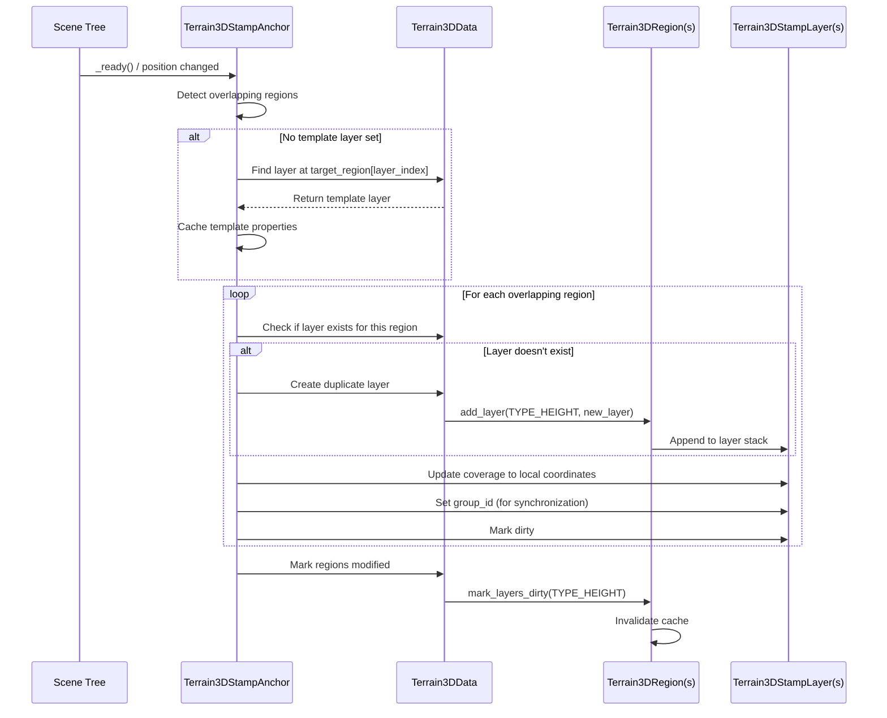

### Terrain3DCurveLayerPath Workflow

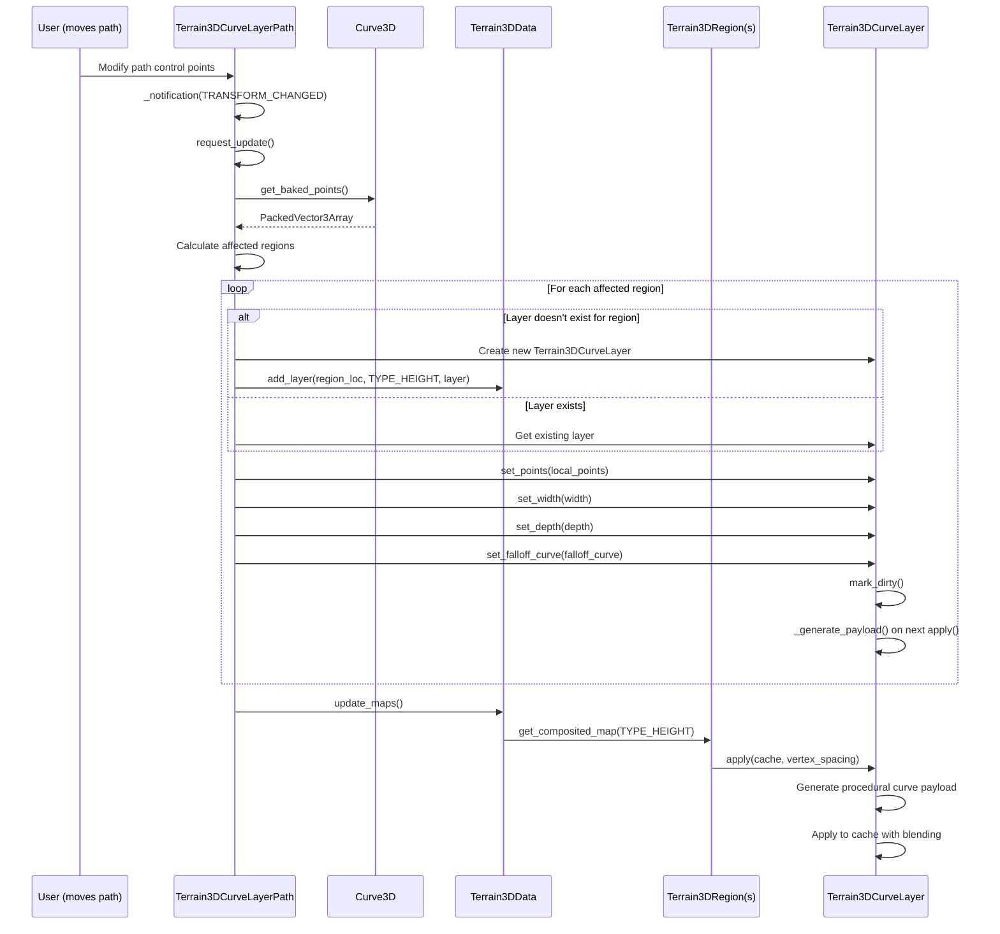

## Data Flow: Layer Application

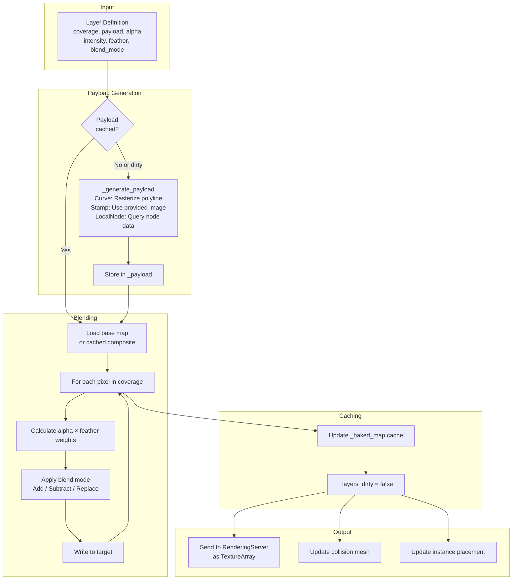

## MapType Refactoring

The `MapType` enum was extracted into a standalone header file for better code organization and to avoid circular dependencies.

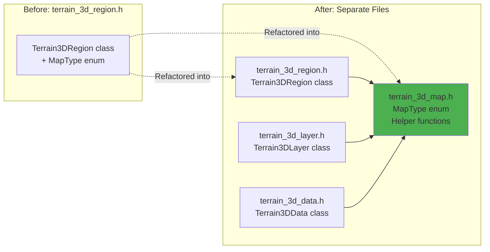

**terrain_3d_map.h** now provides:
```cpp
enum MapType {
    TYPE_HEIGHT,
    TYPE_CONTROL,
    TYPE_COLOR,
    TYPE_MAX,
};

inline Image::Format map_type_get_format(MapType p_type);
inline const char* map_type_get_string(MapType p_type);
inline Color map_type_get_default_color(MapType p_type);
```

## Editor Integration

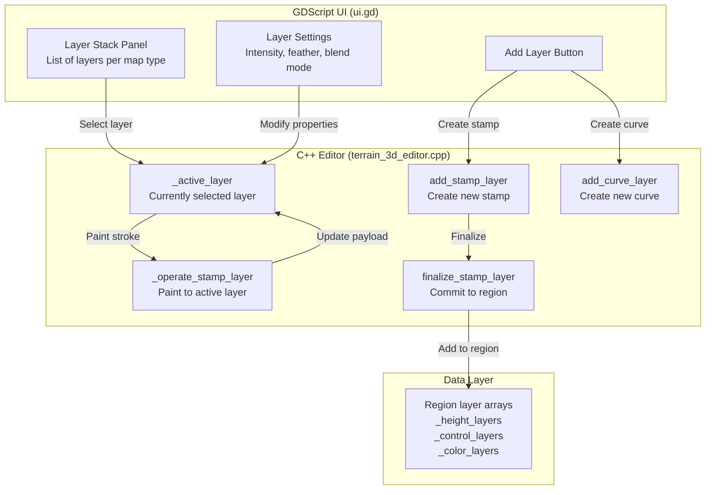

## Key Features

### 1. Non-Destructive Editing
- Base maps remain unchanged
- Layers composite on top at render time
- Easy to enable/disable, reorder, or remove layers

### 2. Layer Types
- **Stamp Layers**: Static image data stamped onto terrain
- **Curve Layers**: Procedurally generated from path data
- **Local Node Layers**: Driven by scene node transforms

### 3. Compositing Performance
- Incremental dirty-rect updates minimize re-compositing cost
- Full-map caching for clean layers (no redundant processing)
- Per-map-type dirty tracking

### 4. Multi-Region Support
- Layers can span multiple regions via layer groups
- Group IDs synchronize layers across region boundaries
- Automatic region creation for stamps/curves that extend beyond loaded tiles

### 5. Blending Controls
- **Blend Modes**: Add, Subtract, Replace
- **Intensity**: Scales layer effect strength
- **Alpha Mask**: Per-pixel layer opacity
- **Feather**: Smooth edge falloff

### 6. Artist-Friendly Tools
- **Terrain3DStampAnchor**: Node3D-based stamp placement with auto-positioning
- **Terrain3DCurveLayerPath**: Path3D-based curve editing with live preview
- Both support auto-update in editor and at runtime

## Performance Characteristics

| Operation | Without Layers | With Layers (Clean) | With Layers (Dirty) |
|-----------|----------------|---------------------|---------------------|
| Map access | Direct Image lookup | Cached composite lookup | Re-composite + cache |
| Incremental edit | Modify base map | Update layer payload | Update layer + dirty rect |
| Render update | Upload base map | Upload cached composite | Re-composite then upload |
| Memory overhead | 3 maps × region_size² | + 3 cached composites | Same |
| Best for | Simple terrain | Complex multi-layer setups | Interactive layer editing |

## Usage Examples

### Creating a Stamp Layer (C++)
```cpp
// In Terrain3DEditor
Ref<Image> stamp_image = ...; // Load or generate
Ref<Image> alpha_mask = ...; // Optional
Vector3 world_pos = Vector3(100, 0, 100);
real_t radius = 50.0;

add_stamp_layer(world_pos, radius, stamp_image, alpha_mask, Terrain3DRegion::TYPE_HEIGHT);
// Returns a Terrain3DStampLayer that can be further edited
```

### Creating a Curve Layer (GDScript)
```gdscript
# Add Terrain3DCurveLayerPath node to scene
var curve_path = Terrain3DCurveLayerPath.new()
curve_path.terrain_path = ^"../Terrain3D"
curve_path.width = 10.0
curve_path.depth = -2.0  # Carve 2m deep
curve_path.feather_radius = 3.0
add_child(curve_path)

# Modify the path's curve property to define the road/river
curve_path.curve.add_point(Vector3(0, 5, 0))
curve_path.curve.add_point(Vector3(50, 5, 20))
curve_path.curve.add_point(Vector3(100, 8, 15))
```

### Placing a Multi-Region Stamp (GDScript)
```gdscript
# Add Terrain3DStampAnchor node to scene
var anchor = Terrain3DStampAnchor.new()
anchor.terrain_path = ^"../Terrain3D"
anchor.map_type = Terrain3DRegion.TYPE_HEIGHT
anchor.auto_create_regions = true  # Create regions as needed
add_child(anchor)

# Move the anchor - it automatically updates all affected regions
anchor.global_position = Vector3(500, 0, 500)
```

## Implementation Files

### C++ Core
- **src/terrain_3d_layer.h/cpp**: Base layer class and specializations
- **src/terrain_3d_region.h/cpp**: Layer compositing and caching logic
- **src/terrain_3d_data.h/cpp**: Layer group management
- **src/terrain_3d_editor.h/cpp**: Layer editing operations
- **src/terrain_3d_map.h**: MapType enum and utilities

### GDScript Helpers
- **project/addons/terrain_3d/src/stamp_layer_anchor.gd**: Stamp anchor node
- **project/addons/terrain_3d/src/curve_layer_path.gd**: Curve path node
- **project/addons/terrain_3d/src/ui.gd**: Layer stack UI integration

### Demo
- **project/demo/src/LayerDemo.gd**: Example layer usage