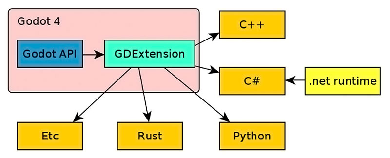

Programming Languages
=====================

Any language Godot supports should be able to work with Terrain3D via
the GDExtension interface. This includes
`C# <https://docs.godotengine.org/en/stable/tutorials/scripting/c_sharp/index.html>`__,
and `several
others <https://docs.godotengine.org/en/stable/tutorials/scripting/gdextension/what_is_gdextension.html#supported-languages>`__.

Here are some tips for integrating with Terrain3D.

Detecting If Terrain3D Is Installed
-----------------------------------

To determine if Terrain3D is installed and active, `ask
Godot <https://docs.godotengine.org/en/stable/classes/class_editorinterface.html#class-editorinterface-method-is-plugin-enabled>`__.

Using C# might be different depending if you generated Bindings :doc:`Generating C# Bindings <generating_csharp_bindings>`. So the Third tab is for if you have C# Bindings available

.. tabs::

   .. tab:: GDScript

        .. code:: gdscript

            print("Terrain3D installed: ", EditorInterface.is_plugin_enabled("terrain_3d"))

   .. tab:: C#

        .. code:: c#

            GetEditorInterface().IsPluginEnabled("terrain_3d")

   .. tab:: C# (Generated Bindings)

        .. code:: c#

            using TokisanGames;

            ...

            GetEditorInterface().IsPluginEnabled(nameof(Terrain3D))

You can also ask ClassDB if the class exists:

.. tabs::

   .. tab:: GDScript

        .. code:: gdscript

            ClassDB.class_exists("Terrain3D")
            ClassDB.can_instantiate("Terrain3D")

   .. tab:: C#

        .. code:: c#

            ClassDB.ClassExists("Terrain3D");
            ClassDB.CanInstantiate("Terrain3D");

   .. tab:: C# (Generated Bindings)

        .. code:: c#

            using TokisanGames;

            ...

            ClassDB.ClassExists(nameof(Terrain3D));
            ClassDB.CanInstantiate(nameof(Terrain3D));

Instantiating & Calling Terrain3D
---------------------------------

Terrain3D is instantiated and referenced like any other object.

See the ``CodeGenerated.tscn`` demo for an example of initiating
Terrain3D from script.

.. tabs::

   .. tab:: GDScript

        .. code:: gdscript

            var terrain: Terrain3D = Terrain3D.new()
            terrain.assets = Terrain3DAssets.new()
            print(terrain.get_version())

   .. tab:: C#
        You can instantiate through ClassDB, set variables and call it.

        .. code:: c#

            var terrain = ClassDB.Instantiate("Terrain3D");
            terrain.AsGodotObject().Set("assets", ClassDB.Instantiate("Terrain3DAssets"));
            terrain.AsGodotObject().Call("set_show_region_grid", true);

   .. tab:: C# (Generated Bindings)

        .. code:: c#

            using TokisanGames;

            ...

            var terrain = Terrain3D.Instantiate();
            terrain.SetAssets(Terrain3DAssets.Instantiate());
            // or: terrain.Assets = Terrain3DAssets.Instantiate();
            terrain.SetShowRegionGrid(true);

You can also check if a node is a Terrain3D object:

.. tabs::

   .. tab:: GDScript

        .. code:: gdscript

            if node is Terrain3D:

   .. tab:: C#

        .. code:: c#

            private bool CheckTerrain3D(Node myNode) {
                if (myNode.IsClass("Terrain3D")) {
                    var collisionMode = myNode.Call("get_collision_mode").AsInt32();
                }
                ...
            }

   .. tab:: C# (Generated Bindings)

        .. code:: c#

            using TokisanGames;

            ...

            private bool CheckTerrain3D(Node myNode)
            {
                if (myNode.IsClass(nameof(Terrain3D)))
                {
                    var terrain = Terrain3D.Bind(myNode);
                    var collisionMode = terrain.GetCollisionMode();
                }
                ...
            }

For more information on C# and other languages, read `Cross-language
scripting <https://docs.godotengine.org/en/stable/tutorials/scripting/cross_language_scripting.html>`__
in the Godot docs.

Finding the Terrain3D Instance
------------------------------

These options are for programming scenarios where a user action is
intented to provide your code with the Terrain3D instance.

-  If collision is enabled in game (default) or in the editor (debug
   only), you can run a raycast and if it hits, it will return a
   ``Terrain3D`` object. See more in the
   `raycasting <collision.md#physics-based-collision-raycasting>`__
   section.

-  Your script can provide a NodePath and allow the user to select their
   Terrain3D node.

-  You can search the current scene tree for `nodes of
   type <https://docs.godotengine.org/en/stable/classes/class_node.html#class-node-method-find-children>`__
   “Terrain3D”.

.. tabs::

   .. tab:: GDScript

        .. code:: gdscript

            var terrain: Terrain3D # or Node if you aren't sure if it's installed
            if Engine.is_editor_hint(): # In editor
                terrain = get_tree().get_edited_scene_root().find_children("*", "Terrain3D").front()
            else: # In game
                terrain = get_tree().get_current_scene().find_children("*", "Terrain3D").front()

            if terrain:
                print("Found terrain")

   .. tab:: C# (Generated Bindings)

        .. code:: c#

            using TokisanGames;

            ...

            Node terrainNode;

            if (Engine.IsEditorHint())
                terrainNode = GetTree().GetEditedSceneRoot().FindChildren("*", nameof(Terrain3D)).FirstOrDefault();
            else
                terrainNode = GetTree().GetCurrentScene().FindChildren("*", nameof(Terrain3D)).FirstOrDefault();

            if (terrainNode != null)
            {
                GD.Print("Found terrain");
                var terrain = Terrain3D.Bind(terrainNode);
            }

Detecting Terrain Height
------------------------

See `Collision <collision.md>`__ for several methods.

Getting Updates on Terrain Changes
----------------------------------

``Terrain3DData`` has
`signals <../api/class_terrain3ddata.rst#signals>`__ that fire when
updates occur. You can connect to them to receive updates.