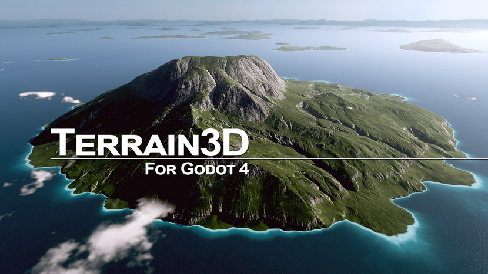

.. Terrain3D documentation master file, created by
   sphinx-quickstart on Wed Nov 29 15:57:36 2023.
   You can adapt this file completely to your liking, but it should at least
   contain the root `toctree` directive.

|logo|

Terrain3D Documentation
===============================

`Terrain3D <https://github.com/TokisanGames/Terrain3D>`_ is a high performance, editable terrain system for Godot 4.

Start with :doc:`Introduction <docs/introduction>` and the other pages in the Getting Started section in the left sidebar to learn how to use this system.

Credit
-------------
Developed for the Godot community by:

+------------------------------------+-------------------------------------+
| **Cory Petkovsek, Tokisan Games**  | |t-x| |t-gh| |t-web| |t-ds| |t-yt|  |
+------------------------------------+-------------------------------------+
| **Roope Palmroos, Outobugi Games** | |o-x| |o-gh| |o-web| |o-yt|         |
+------------------------------------+-------------------------------------+

.. |t-x| image:: https://github.com/dmhendricks/signature-social-icons/blob/master/icons/round-flat-filled/35px/twitter.png?raw=true
   :target: https://twitter.com/TokisanGames
   :width: 24

.. |t-gh| image:: https://github.com/dmhendricks/signature-social-icons/blob/master/icons/round-flat-filled/35px/github.png?raw=true
   :target: https://github.com/TokisanGames
   :width: 24

.. |t-web| image:: https://github.com/dmhendricks/signature-social-icons/blob/master/icons/round-flat-filled/35px/www.png?raw=true
   :target: https://tokisan.com/
   :width: 24

.. |t-ds| image:: https://github.com/dmhendricks/signature-social-icons/blob/master/icons/round-flat-filled/35px/discord.png?raw=true
   :target: https://tokisan.com/discord
   :width: 24

.. |t-yt| image:: https://github.com/dmhendricks/signature-social-icons/blob/master/icons/round-flat-filled/35px/youtube.png?raw=true
   :target: https://www.youtube.com/@TokisanGames
   :width: 24

.. |o-x| image:: https://github.com/dmhendricks/signature-social-icons/blob/master/icons/round-flat-filled/35px/twitter.png?raw=true
   :target: https://twitter.com/outobugi
   :width: 24

.. |o-gh| image:: https://github.com/dmhendricks/signature-social-icons/blob/master/icons/round-flat-filled/35px/github.png?raw=true
   :target: https://github.com/outobugi
   :width: 24

.. |o-web| image:: https://github.com/dmhendricks/signature-social-icons/blob/master/icons/round-flat-filled/35px/www.png?raw=true
   :target: https://outobugi.com/
   :width: 24

.. |o-yt| image:: https://github.com/dmhendricks/signature-social-icons/blob/master/icons/round-flat-filled/35px/youtube.png?raw=true
   :target: https://www.youtube.com/@outobugi
   :width: 24

And other contributors displayed on `github contributors <https://github.com/TokisanGames/Terrain3D/graphs/contributors>`_ and in :doc:`docs/authors`.

Geometry clipmap mesh code created by `Mike J. Savage <https://mikejsavage.co.uk/blog/geometry-clipmaps.html>`_. Blog and repository code released under the MIT license per email communication with Mike.

.. toctree::
   :maxdepth: 1
   :caption: About

   docs/games
   docs/press
   docs/authors
   docs/license

.. toctree::
   :maxdepth: 1
   :caption: Getting Started

   docs/introduction
   docs/tutorial_videos
   docs/installation
   docs/platforms
   docs/user_interface
   docs/troubleshooting
   docs/getting_help

.. toctree::
   :maxdepth: 1
   :caption: Basic Usage

   docs/texture_prep
   docs/texture_painting
   docs/heightmaps
   docs/import_export
   docs/instancer
   docs/tips

.. toctree::
   :maxdepth: 1
   :caption: Advanced Usage

   docs/collision
   docs/double_precision
   docs/navigation
   docs/occlusion_culling
   docs/programming_languages

.. toctree::
   :maxdepth: 1
   :caption: Development

   docs/nightly_builds
   docs/building_from_source
   docs/system_architecture
   docs/shader_design
   docs/controlmap_format
   docs/data_format
   docs/contributing

.. toctree::
   :maxdepth: 2
   :caption: API

   api/index
